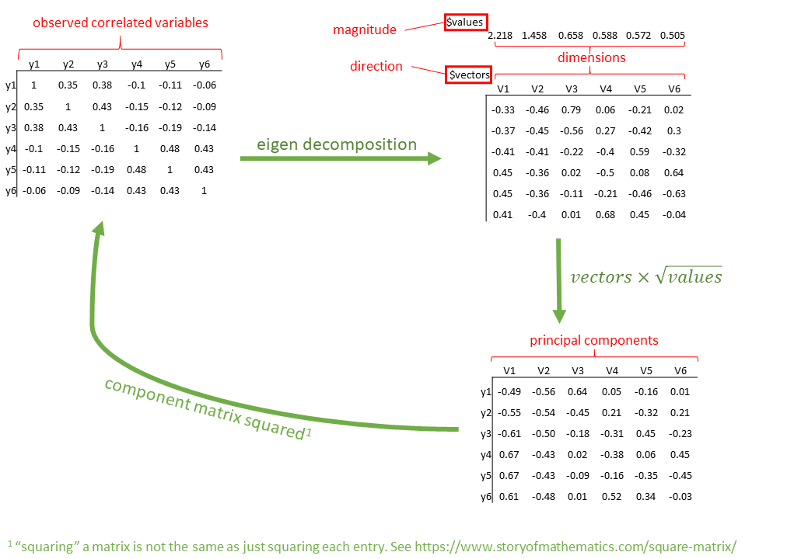

```{r}
#| label: setup
#| include: false
source('assets/setup.R')
library(xaringanExtra)
library(tidyverse)
library(patchwork)
library(ggdist)
xaringanExtra::use_panelset()
qcounter <- function(){
  if(!exists("qcounter_i")){
    qcounter_i <<- 1
  }else{
    qcounter_i <<- qcounter_i + 1
  }
  qcounter_i
}
```

:::lo

This reading:

- build the intuition for thinking about "dimensions" of data
- introduce some key goals and methods that researchers use, and how these differ in relation to finding and using dimensions of data


:::

# The dimensionality of data

Take a moment to think about the various things that you are often interested in when discussing psychology. This might be anything from personality traits, to language proficiency, social identity, anxiety etc. 
How we measure such constructs is a very important consideration for research. The things we're interested in are very rarely the things we are *directly* measuring. 

Consider how we might assess levels of anxiety or depression. Can we ever directly measure anxiety?^[Even if we cut open someone's brain, it's unclear what we would be looking for in order to 'measure' it. It is unclear whether anxiety even exists as a physical thing, or rather if it is simply the overarching concept we apply to a set of behaviours and feelings.] More often than not, we measure these things using a _set_ of different measures which 'look at' the underlying construct from a different angle. In psychology, this is often questionnaire based methods, with a set of questions each of which might ask about "anxiety" from a slightly different angle. Twenty questions all measuring different aspects of anxiety are (we hope) going to correlate with one another if they are capturing some commonality (the construct of "anxiety").  

But this introduces a problem for us, which is how to deal with 20 variables that represent (in broad terms) the same single thing. How can we talk about "changes in anxiety", and not just "changes on anxiety Q1" and "changes on anxiety Q2" and so on? In addition, not all of these constructs might have just one single dimension - we often talk about "narcissm", but this could arguably be comprised of 3 slightly distinct constructs of "grandiosity", "vulnerability" and "antagonism".  

What we are touching upon here gets referred to as *dimensionality* of a measurement tool, and the questions we are going to look at are all about how we can go from the big set of observed variables to the key *dimensions* that are the things we are actually interested in.  

:::sticky
__When might we want to reduce dimensionality?__

There are many reasons we might want to "reduce the dimensionality" of data:  

- Pragmatic
  - I have multicollinearity issues/too many variables, how can I defensibly combine my variables? 
- Test construction
  - How should I group my questionnaire items into sub-scales?
  - Which items are the best measures of my construct(s)?
- Theory testing
  - What are the number and nature of dimensions that best describe a theoretical construct?
  
:::


# The core idea


```{r include=FALSE}
library(rgl)
library(psych)
set.seed(33)
S = runif(3,.4,2)
f = runif(3,.7,.99)
R = f %*% t(f)
diag(R) = 1
R[1,3] <- R[2,3] <- R[3,1] <- R[3,2] <- .1
Sigma = diag(S)%*%R%*%diag(S)
Mean <- rep(0,3)
x <- MASS::mvrnorm(500, Mean, Sigma)
mydata <- as.data.frame(x)
names(mydata) <- c("y1","y2","y3")
```

Imagine we had 3 measured variables: y1, y2, and y3, as visualised in 3-dimensional space in @fig-scat.   

::::{.columns}
:::{.column width="50%"}
```{r}
#| echo: false
#| label: fig-scat
#| fig-cap: "3 measured variables"
plot3d(x, box = FALSE, xlab="y1",ylab="y2",zlab="y3")
rglwidget()
```

:::
:::{.column width="50%"}
```{r}
#| echo: false
#| label: fig-ellip
#| fig-cap: "An ellipse capturing the cloud of datapoints, the axes shows the length, width and depth of the ellipse"
plot3d(x, box = FALSE, xlab="y1",ylab="y2",zlab="y3")
plot3d(ellipse3d(Sigma, centre = Mean), col = "#A41AE4", alpha = 0.4, add = TRUE)
plot3d(
  abclines3d(0,0,0,a=principal(x,nfactors=3,rotate="none")$loadings[,1],
             col="green"),lwd=2, add=TRUE)
plot3d(
  abclines3d(0,0,0,a=principal(x,nfactors=3,rotate="none")$loadings[,2],
             col="red"), lwd=2, add=TRUE)
plot3d(
  abclines3d(0,0,0,a=principal(x,nfactors=3,rotate="none")$loadings[,3],
           col="blue"), lwd=2, add=TRUE)
rglwidget()

```
:::
::::

Although we have measured 3 variables (`y1`, `y2`, `y3`), when faced with trying to characterise the shape of the 3-dimensional cloud of datapoints, we're more inclined to think about its length, width and depth. You can imagine trying to characterise this shape as the ellipse in @fig-ellip. It looks a little like a bar of soap or something! It's longer in one direction (green line), wide in another direction (red line), and not very deep (blue line). We can think of these as the dimensions that characterise the data.  

::: {.callout-note collapse="false"}
#### a correlation matrix

The example here has 3 variables, which means 3-dimensions, and this is why we can actually visualise it. But we could also think of this shape as being described by all the correlations between each pair of variables. Each of these correlations is characterising the plot of each pair of variables, and these are just like viewing the 3-d plot above but looking at it from straight on at each side.^[Rotate the 3-d plot to make it match the 2-d plots below!] So in cases where we have lots and lots of variables, we might not be able to visualise the n-dimensional shape itself, but we can look at it from all different angles through the correlation matrix!  

::::{.columns}
:::{.column width="48%"}
```{r}
cor(mydata)
```
:::
:::{.column width="4%"}
:::
:::{.column width="48%"}
```{r}
pairs(mydata)
```
:::
::::

:::

Think a little about what these dimensions (the axes in @fig-ellip) *represent* - they capture "the ways in which observations vary" across a set of observed variables. The long dimension captures that `y1` and `y2` tend to co-vary (there are lots of people who are high on both `y1` and `y2`, and lots who are low on both). The wider dimension captures that there's another source of variability, mainly tied to being high or low on `y3`. 

Often it helps to take this to the extremes, so think about what these would look like if we *no correlations* or *perfect correlations* between the three variables. If the variables are uncorrelated, then we have a sort of spherical cloud of data, and no one dimension is longer than the other (@fig-pcano). By contrast, if we have perfect correlations between the variables, then we only really have *one* dimension - we just have a line upon which all observations fall (@fig-pcaff).  

::::{.columns}
:::{.column width="50%"}
```{r}
#| echo: false
#| label: fig-pcano
#| fig-cap: "Principal components for 3 uncorrelated variables"
set.seed(33)
S = runif(3,.4,2)
f = runif(3,0,.1)
R = f %*% t(f)
diag(R) = 1
Sigma2 = diag(S)%*%R%*%diag(S)
Mean2 <- rep(0,3)
x2 <- MASS::mvrnorm(500, Mean2, Sigma2)
plot3d(x2, box = FALSE, xlab="y1",ylab="y2",zlab="y3")
plot3d( ellipse3d(Sigma2, centre = Mean2), col = "#A41AE4", alpha = 0.4, add = TRUE)
plot3d(
  abclines3d(0,0,0,a=principal(x,nfactors=3,rotate="none")$loadings[,1],
             col="green"),lwd=2, add=TRUE)
plot3d(
  abclines3d(0,0,0,a=principal(x,nfactors=3,rotate="none")$loadings[,2],
             col="red"), lwd=2, add=TRUE)
plot3d(
  abclines3d(0,0,0,a=principal(x,nfactors=3,rotate="none")$loadings[,3],
           col="blue"), lwd=2, add=TRUE)
rglwidget()
```
:::
:::{.column width="50%"}

```{r}
#| echo: false
#| label: fig-pcaff
#| fig-cap: "Principal components for 3 perfectly correlated variables"
S = runif(3,.4,2)
f = runif(3,1,1)
R = f %*% t(f)
diag(R) = 1
Sigma2 = diag(S)%*%R%*%diag(S)
Mean2 <- rep(0,3)
x2 <- MASS::mvrnorm(500, Mean2, Sigma2)

plot3d(x2, box = FALSE, xlab="y1",ylab="y2",zlab="y3")
rglwidget()
```
:::
::::


Imagine being given a ruler and being asked to give two numbers to provide a measurement of your smartphone. What do you pick? Chances are, you will measure its length and then its width. You're likely to ignore the depth because it is much smaller than the other two dimensions. This is pretty much the concept of dimension reduction. 

The idea here is that we can --- without losing too much --- preserve the general shape of our data using _fewer_ dimensions. Ignoring the depth of our cloud of datapoints, we could reduce from 3 variables down to 2 dimensions by considering where our data falls when projected onto the 2-dimensional surface shown in @fig-ellipreduc. Or we could reduce down to 1 dimension and consider where the data falls on the single axis shown in @fig-ellipreduc2.  

::::{.columns}
:::{.column width="50%"}
```{r}
#| echo: false
#| label: fig-ellipreduc
#| fig-cap: "A 2-d ellipse capturing most of the variability in a 3-d cloud of datapoints. Black points show original values on measured variables, blue lines show projections onto the new dimensions."
set.seed(33)
S = runif(3,.4,2)
f = runif(3,.7,.99)
R = f %*% t(f)
diag(R) = 1
R[1,3] <- R[2,3] <- R[3,1] <- R[3,2] <- .1
Sigma = diag(S)%*%R%*%diag(S)
Mean <- rep(0,3)
x <- MASS::mvrnorm(500, Mean, Sigma)


plot3d(x, box = FALSE, xlab="y1",ylab="y2",zlab="y3", alpha=.5)

xx = apply(x, 2, \(y) resid(lm(y ~ psych::principal(x,3,rotate="none")$scores[,3]))+
             rnorm(nrow(x),0,.001))
Sigma = cov(xx)
Mean = apply(xx,2,mean)
plot3d(ellipse3d(Sigma, centre = Mean, subdivisions = 50),
        col = "#A41AE4", alpha = 0.4, add = TRUE)
points3d(xx,add=T,col="#A41AE4")
for(i in 1:nrow(x)){
  segments3d(x = c(x[i,1],xx[i,1]),
              y = c(x[i,2],xx[i,2]),
              z = c(x[i,3],xx[i,3]),
              col="blue", lwd=.5, alpha=.5)

}
rglwidget()

```
:::
:::{.column width="50%"}
```{r}
#| echo: false
#| label: fig-ellipreduc2
#| fig-cap: "A 1-d line capturing most of the variability in a 3-d cloud of datapoints. Black points show original values on measured variables, blue lines show projections onto the new dimensions."
set.seed(33)
plot3d(x, box = FALSE, xlab="y1",ylab="y2",zlab="y3", alpha=.5)

# plot3d(abclines3d(0,0,0,a=principal(x,nfactors=3,rotate="none")$loadings[,1],
#              col = "#A41AE4"), lwd=2, add=TRUE)
xx = apply(x, 2, \(y) resid(lm(y ~ psych::principal(x,3,rotate="none")$scores[,2:3]))+
             rnorm(nrow(x),0,.0001))
# xx = apply(x, 2, \(y) resid(lm(y ~ rowMeans(x))))
points3d(xx,add=T,col="#A41AE4")
lines3d(xx,add=T,col="#A41AE4")
for(i in 1:nrow(x)){
  segments3d(x = c(x[i,1],xx[i,1]),
              y = c(x[i,2],xx[i,2]),
              z = c(x[i,3],xx[i,3]),
              col="blue", lwd=.5,lty="dotted",alpha=.5)

}

rglwidget()

```

:::
::::


The conceptual idea of these 'dimensions' that we're working with here is pretty abstract, and it only gets weirder to think about when we have more than 3 variables and we can no longer easily visualise it. 

The key thing we are doing here is:

1. Identify the dimensions that capture (co)variability across a set of measured variables
2. Retain a subset of those dimensions


Depending upon what the goal of our research is, the key questions are going to be:

1. how do we find the dimensions?
2. how many dimensions should we retain?
3. how does each dimension relate back to the original measured variables?  


# The key methods

```{r}
#| include: false
somedata = lavaan::simulateData(
  paste0("f1=~",paste0(runif(3,.8,1),"*y",1:3,collapse="+"),
         "\nf2=~",paste0(runif(3,.8,1),"*y",4:6,collapse="+"),
         "\nf1~~-.3*f2")
) |> mutate(across(everything(), ~as.numeric(cut(.,9))))

cor(somedata) |> round(2)

set.seed(475)
nitem <- 6
A <- matrix(runif(nitem^2,.41,1)*2-1, ncol=nitem) 
scor <- t(A) %*% A
df <- MASS::mvrnorm(n=220,mu=rep(0,6),Sigma = scor) |> as.data.frame()

physfunc <- df |> transmute(
  mobility = round(550 + scale(V1)[,1]*75),
  balance = round(20 + scale(V2)[,1]*5, 2),
  flexibility = round(7.5 + scale(V3)[,1]*1.25 + 2),
  strength = round(35 + scale(V4)[,1]*7.5),
  coordination = round(1.5+scale(V5)[,1]*.25, 3),
  fine_motor = round(20+scale(V6)[,1]*2.5,2)
) 

nitem <- 2
A <- matrix(runif(nitem^2,.41,1)*2-1, ncol=nitem) 
scor <- t(A) %*% A
df <- MASS::mvrnorm(n=220,mu=rep(0,2),Sigma = scor) |> as.data.frame()
physfunc2 <- df |> transmute(
  respiratory = round(550 + scale(V1)[,1]*100),
  endurance = round(15 + scale(V2)[,1]*2.5, 2)
)
physfunc <- bind_cols(physfunc,physfunc2) |>
  relocate(endurance, .after=balance)
# write_csv(physfunc, file="../../data/physfunc.csv")

```


## Naive scale scores

Goal: Pragmatic. I want 1 thing to use in some other setting (e.g., in a further analysis, or in a clinical setting)

1. How do we find the dimensions?
    - There's only one
2. How many dimensions should we retain?
    - There's only one
3. How does each dimension relate back to the original measured variables?  
    - All variables equally related to dimension
  
::: {.callout-note collapse="true"}
#### Demonstration

Typically scale scores are either mean scores or sum scores. These are, for each person, the mean, or the sum, of their scores on each item.  

Because we are wanting this for each person, and each person is a row in our dataset, so we want row means, or row sums. 
```{r}
somedata$meanscore <- rowMeans(somedata[,1:6])
somedata$sumscore <- rowSums(somedata[,1:6])
```

:::  


## Principal Component Analysis (PCA)

Goal: Pragmatic. I want fewer things for use in a subsequent analysis but don't want to lose too much variability. I want those things to be uncorrelated.^[I might want this if, e.g., I have issues with multicollinearity of predictors in a regression model]

1. How do we find the dimensions?
    - Set of orthogonal (i.e., perpendicular^[like all those that we've seen above] therefore uncorrelated) dimensions that sequentially capture most variability.
    - Found via some complicated maths that feels a bit like magic! It utilises a method called "eigen decomposition", the details of which are beyond the scope of this course, but the high level idea is given below.  
2. How many dimensions should we retain?
    - Pragmatic: defined by either the number of dimensions we want, or the proportion of variability we want to retain
    - Tools (detailed below) such as **scree plots**, **parallel analysis** and **minimum average partial (MAP)** can guide us towards how many dimensions capture a "substantial" amount of variability in the data.
3. how does each dimension relate back to the original measured variables?  
    - Examine correlations between dimensions and variables
    - Somewhat irrelevant for 'pure' PCA, where we are agnostic/don't care about what the dimensions _are._  
    
::: {.callout-note collapse="true"}
#### Demonstration

:::frame
__Dataset: physfunc.csv__  

These data contain measurements on 220 individuals on various measures of physical functioning:  

- Mobility: 6-Minute Walk Test (distance in metres walked in 6 minutes).
- Balance: Single-Leg Stance Test (time in seconds standing on one leg). 
- Endurance: Stair Climb Test (time in seconds taken to climb a set number of stairs).
- Flexibility: Sit and Reach Test (distance in cm reached beyond the feet while seated).
- Strength: Grip Strength Test (measured in kilograms using a dynamometer).
- Fine Motor Skills: Nine-Hole Peg Test (time in seconds to place and remove pegs from a board).
- Respiratory Function: Forced Expiratory Volume in 1 Second (FEV1) (measured in Liters per second using a spirometer).  

Dataset: [https://uoepsy.github.io/data/physfunc.csv](https://uoepsy.github.io/data/physfunc.csv){target="_blank"}

:::

```{r}
physfunc <- read_csv("https://uoepsy.github.io/data/physfunc.csv")
head(physfunc)
```


Using `principal()` from the **{{psych}}** package, with 8 observed variables, we are working in 8 dimensions. These observed variables are all correlated, and PCA re-expresses the information onto **un**-correlated (i.e. perpendicular) dimensions.  

This is achieved using "eigen decomposition" which is a fairly complex calculation performed on the correlation matrix. 



+ **Completely Optional:** [some of the maths behind it](z_eigen.html){target="_blank"}


With $p$ variables, we can get out $p$ orthogonal dimensions, which here we call "principal components".  In the `principal()` function, we can set `nfactors = 8` to extract 8 dimensions.^[If we chose a lower number, e.g., `nfactors = 6`, it would _not show_ the 7th and 8th components]

```{r}
library(psych)
fullpca <- principal(physfunc[,1:8], 
                     nfactors = 8, rotate = "none")
```

### Variance Accounted For

Because the process of eigen decomposition is essentially just a _re-expression_ of our correlation matrix, we if we take our 8 principal components all together, we are explaining **all** of the variance in the original data. In other words, the total variance of the principal components (the sum of their variances) is equal to the total variance in the original data (the sum of the variances of the variables). This makes sense - we have simply gone from having 8 correlated variables to having 8 orthogonal (unrelated) components - we haven't lost any variance. 

The key benefit of PCA is that our orthogonal components have *sequential variance maximisation* - i.e., the first captures the most variance, then the second captures the second most, and so on.. So if we just want to reduce down to 1 dimension, then we just keep the first component. If we want to keep some pre-specified amount (e.g., 80%) of variability, then accessing `Vaccounted` will give us information on the amount of variance captured by each component:  

```{r}
fullpca$Vaccounted
```

- **SS loadings:** The sum of the squared loadings (these are also the "eigenvalues"). These represent the amount of variance explained by each component, out of the total variance (which is 8, because we have 8 variables (the variables are all standardised, meaning they each have a variance of 1. $8 \times 1 = 8$ so we can think of the total variance as 8!)  
- **Proportion Var:** The proportion the overall variance the component accounts for out of all the variables. 
- **Cumulative Var:** The cumulative sum of Proportion Var.
- **Proportion Explained:** relative amount of variance explained ($\frac{\text{Proportion Var}}{\text{sum(Proportion Var)}}$.
- **Cumulative Proportion:** cumulative sum of Proportion Explained.

There are lots of methods to help us decide how many components we should keep. 

::: {.callout-note collapse="true"}
#### Scree plot 

Scree plots show the eigenvalues for each dimension. A typical scree plot features higher variances for the initial components and quickly drops to small variances where the curve is almost flat. The flat part of the curve represents the noise components, which are not able to capture the main sources of variability in the system. 

According to the scree plot criterion, we should **keep as many principal components up to where the "kink" (or "elbow") in the plot occurs.** So in the above plot, the kink occurs at 3 by my reckoning (yours might be different!), so I would keep 2.  

__NOTE: Scree plots are subjective and may have multiple or no obvious kinks/elbows, making them hard to interpret__  

```{r}
scree(physfunc[,1:8], pc = TRUE, factors = FALSE)
```

The horizontal line is an additional suggestion that we should keep all components for which the eigenvalue is >1. This is known as "Kaiser's Criterion"  

:::

::: {.callout-note collapse="true"}
#### Parallel analysis

 
Parallel analysis involves simulating lots of datasets of the same dimension but in which the variables are uncorrelated. For each of these simulations, a PCA is conducted on its correlation matrix, and the eigenvalues are extracted. We can then compare our eigenvalues from the PCA on our *actual* data to the average eigenvalues across these simulations. 
In theory, for uncorrelated variables, no components should explain more variance than any others, and eigenvalues should be equal to 1. In reality, variables are rarely truly uncorrelated, and so there will be slight variation in the magnitude of eigenvalues simply due to chance. 
The parallel analysis method suggests keeping those components for which the eigenvalues are greater than those from the simulations. 

It can be conducted in R using the `fa.parallel()` function.  
When conducting an EFA (we'll see this later on in these readings) as opposed to a PCA, you can set `fa = "both"` to do this for both factor extraction and principal components.  

```{r}
fa.parallel(physfunc[,1:8], fa = "pc", n.iter = 500)
```

__NOTE: Parallel analysis will sometimes tend to over-extract (suggest too many components)__  

:::

::: {.callout-note collapse="true"}
#### MAP

The Minimum Average Partial (MAP) test computes the partial correlation matrix (adjusting for and removing a component from the correlation matrix), sequentially partialling out each component. At each step, the partial correlations are squared and their average is computed.  
At first, the components which are removed will be those that are most representative of the shared variance between 2+ variables, meaning that the "average squared partial correlation" will decrease. At some point in the process, the components being removed will begin represent variance that is specific to individual variables, meaning that the average squared partial correlation will increase.  
The MAP method is to keep the number of components for which the average squared partial correlation is at the minimum. 

We can conduct MAP in R using the `VSS()` function.  
```{r}
library(psych)
VSS(physfunc[,1:8], rotate = "none", 
    plot = FALSE, fm = "pc")
```
(be aware there is a lot of other information in this output too! For now just focus on the map column), and the part of the output that says "The Velicer MAP achieves a minimum of 0.14  with 1 factors".  

__NOTE: The MAP method will sometimes tend to under-extract (suggest too few components)__ 
 

```{r}
#| include: false
VSS(somedata[,1:6],rotate = "none",fm = "pc")$map

loopdata <- somedata[,1:6]
for(i in 1:6){
  loopdata = apply(loopdata, 2, \(y) resid(lm(y ~ principal(loopdata,nfactors=1,rotate="none")$scores[,1])))
  cc = cor(loopdata)
  cc[lower.tri(cc)]^2 |> mean() |> print()
}
```

:::


### Loadings


Supposing that we decide (based on the scree plot, parallel analysis and MAP) to retain two components, capturing 79% of the total variance, the "loadings" tell us how each component is related back to the original variables.  

So in the case below, we can see that the first component is positively related to most of the variables apart from `endurance` (it's small and negative) and `respiratory` (it's not even shown because it's so small). The second component is related positively to both of these variables, and not clearly related to the others.  

```{r}
pca_2dim <- principal(physfunc[,1:8], 
                     nfactors = 2, rotate = "none")
pca_2dim$loadings
```

__Note: As soon as we start to examine the loadings and try to give some sort of *meaning* to the components, we are going away from a pure form of PCA, and using it more like exploratory factor analysis, which we will see more of below and in the next chapter__


### Scores

When it comes to _using_ the principal components in some subsequent analysis, we need to access the "scores".  

Scores in PCA represent the relative standing of every observation in our dataset on each component.  

These are essentially weighted combinations of an individual's values on the original variables.  
$$
\text{score}_{\text{component j}} = w_{1j}y_1 + w_{2j}y_2 + w_{3j}y_3 +\, ... \, + w_{pj}y_p
$$
Where $w$ are the weights, $y$ the original variable scores. 

::: {.callout-caution collapse="true"}
#### Optional: How are weights calculated?  

The weights are calculated from the eigenvectors as 
$$
w_{ij} = \frac{a_{ij}}{\sqrt{\lambda_j}}
$$
where $w_{ij}$ is the weight for a given variable $i$ on component $j$ , $a_{ij}$ is the value from the eigenvector for item $i$ on component $j$ and $\lambda_{j}$ is the eigenvalue for that component.

The correlations between the scores and the measured variables are what we saw in the "loadings"!

```{r}
# First PC
cor(pca_2dim$scores[,1], physfunc)
```

:::

So we can add these scores to our data: 
```{r}
physfunc$pc1 <- pca_2dim$scores[,1]
physfunc$pc2 <- pca_2dim$scores[,2]
```
And then go and use those in some subsequent analysis instead of our original 8 variables!  

:::


    
## Exploratory Factor Analysis (EFA)

Goal: Exploratory/Discovery/Scale development. I don't have a strong theoretical model yet, but I suspect there are underlying constructs that explain why these variables correlate with each other. I want to discover what those constructs might be and how the variables relate to them.

1. How do we find the dimensions?
    - Estimation
    - Models with different numbers of (possibly correlated) latent dimensions are compared
2. How many dimensions should we retain?
    - The model that "best explains" our observed relationships between variables
    - "best explains" = a theoretical question as much as a numerical one!  
3. How does each dimension relate back to the original measured variables?  
    - Examine "loadings" between dimensions and variables
    
    
## Confirmatory Factor Analysis (CFA)

Goal: Theory testing. I have a theoretical model of how these variables relate to these constructs. I want to test how well that model is reflected in these data  

1. How do we find the dimensions?
    - We define them
2. How many dimensions should we retain?
    - Irrelevant as the dimensions are pre-defined
3. How does each dimension relate back to the original measured variables?  
    - Pre-defined mapping of which variables to which dimensions. Magnitudes and directions are estimated.   
    
