```{r}
#| label: setup
#| include: false
source('assets/setup.R')
library(xaringanExtra)
library(tidyverse)
library(patchwork)
library(ggdist)
xaringanExtra::use_panelset()
qcounter <- function(){
  if(!exists("qcounter_i")){
    qcounter_i <<- 1
  }else{
    qcounter_i <<- qcounter_i + 1
  }
  qcounter_i
}
library(lme4)
```

:::lo

- start thinking about factor analysis as a model of the underlying constructs that *explain* variability in the variables that we observe
- learn about 'rotations' as a way to transform factors in order to be able to provide a clearer interpretation of what those factors represent
- all of the different parts of the EFA output in R

:::

# From pure dimension reduction to EFA  

Most of our introduction to dimension reduction in [Chapter 2](02_dimension_reduction.html){target="_blank"} was conceptually similar to the process of **Principal Component Analysis (PCA)** - the simplest analogy here is to take a real three-dimensional object in your hands (like your phone, for instance), and measure it with two perpendicular dimensions (like its width and height). 

This is going to be our starting point for the more commonly used method in psychology - **Factor Analysis (FA)**. These two methods are very similar to one another, so much so that distinction between the two can get a little blurred (a lot of it just depends on our goals - see [Chapter 2 #the-key-methods](02_dimension_reduction.html#the-key-methods){target="_blank"}). Ultimately they are both methods aimed to get at the dimensions that capture "variability" in the data.  

It's important to think about what we mean by "variability" here - it is variability across a whole set of variables. So if we start with just 3 variables, we can think of all the data visualised in 3-dimensional space. We can see in @fig-scat that the observations vary in all variables. But they vary in a specific way - observations that are high on one tend to be higher on the others. Observations that are lower, tend to be lower on all of them. 


```{r}
#| echo: false
#| label: fig-scat
#| fig-cap: "3 measured variables"
#| fig-height: 3.5
library(rgl)
library(psych)
set.seed(4)
R = matrix(c(1,.6,.8,
             .6,1,.8,
             .8,.8,1),nrow=3)
Sigma = diag(3)%*%R%*%diag(3)
Mean <- rep(0,3)
x <- MASS::mvrnorm(500, Mean, Sigma)
x <- apply(x,2,\(x) as.numeric(cut(x,9)))
mydata <- as.data.frame(x)

names(mydata) <- c("M","P","S")
plot3d(x, box = FALSE, 
       xlab="Mental Fatigue",ylab="Physical Fatigue",zlab="Sleepiness")
rglwidget()
```

The methods we are looking at now are concerned with capturing this variability in fewer "dimensions" - i.e., without having to refer to all variables "Mental Fatigue","Physical Fatigue", and "Sleepiness", couldn't we instead simply say that an observation is high/low on the dimension of 'tiredness'.  

Where **Principal Component Analysis (PCA)** aims to summarise a set of measured variables into a set of orthogonal (uncorrelated) dimensions, **Factor Analysis (FA)** is more of an *explanatory* tool, in that we are assuming that the relationships between a set of measured variables can be **explained by** a number of underlying *latent factors*. This distinction is a little subtle, but essentially as soon as we start to give _meaning_ to the dimensions, we are in the world of factor analysis. 

:::sticky


| | Principal Component Analysis | Factor Analysis |
|-|-----------------------------| ----------------|
| **what it does** | take a set of correlated variables, reduce to orthogonal dimensions that capture variability |  take a set of correlated variables, ask what set of dimensions (not necessarily orthogonal!) **explain** variability |
| **what the dimensions are** | dimensions are referred to as "components" - they are simply "composites" and do not necessarily exist | dimensions are referred to as "factors". They are assumed to be underlying latent variables that are the cause of why people have different scores on the observed variables | 
| **example** | Socioeconomic status (SES) might be a composite measure of family income, parental education, etc. If my SES increases, that doesn't mean my parents suddenly get more education (it's the other way around) | Anxiety (the unmeasurable construct) is a latent factor. My underlying anxiety is what causes me to respond "strongly agree" to "I am often on edge" | 

 
:::


# Thinking in diagrams

One way to think about this is to draw the two approaches in diagrammatic form, mapping the relationships between variables. There are conventions for these sort of diagrams:  

- squares = variables we observe
- circles = variables we don't observe
- single-headed arrows = regression paths (pointed at outcome)
- double-headed arrows = correlation  

In the diagrams below, note how the directions of the arrows are different between PCA and FA - in PCA, each component $C_i$ is the weighted combination of the observed variables $y_1, ...,y_n$, whereas in FA, each measured variable $y_i$ is seen as *generated by* some latent factor(s) $F_i$ plus some unexplained variance $u_i$.   

### PCA as a diagram  

Note that the idea of a 'composite' requires us to use a special shape (the hexagon), but many people would just use a square.
```{r}
#| echo: false
#| out-width: "100%"
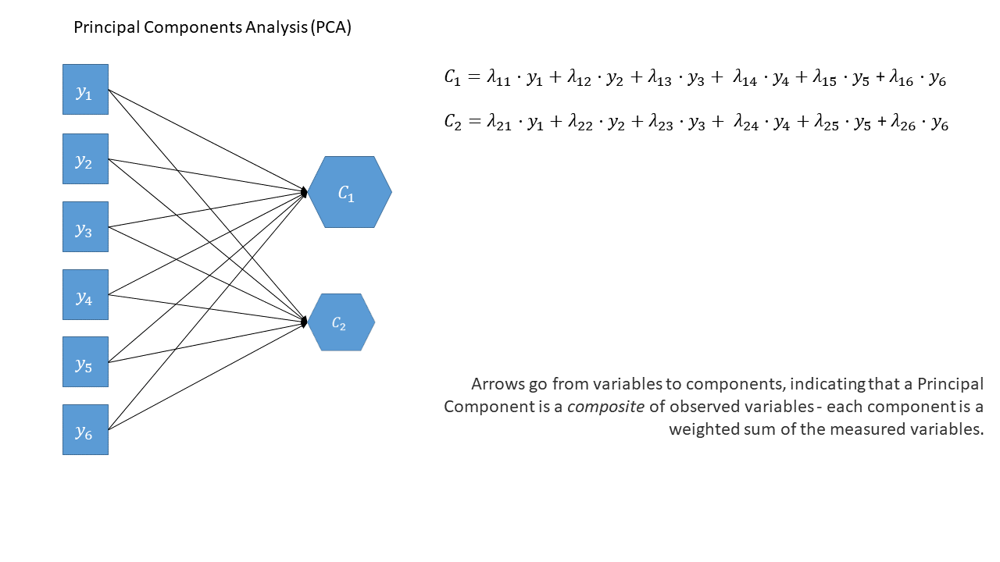
```

::: {.callout-tip collapse="true"}
#### optional: PCA in full

Principal components sequentially capture the orthogonal (i.e., perpendicular) dimensions of the dataset with the most variance. The data reduction comes when we retain fewer components than we have dimensions in our original data. So if we were being pedantic, the diagram for PCA would look something like the diagram below. 
```{r}
#| echo: false
#| out-width: "100%"
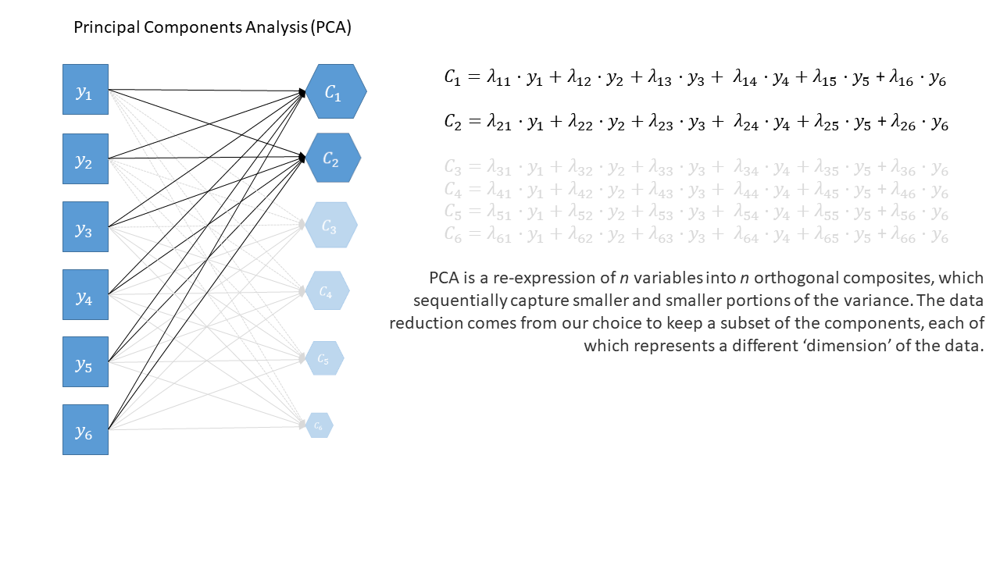
```

:::

### EFA as a diagram  

Exploratory Factor Analysis as a diagram has arrows going from the factors to the observed variables. Unlike PCA, we also have 'uniqueness' factors for each variable, representing the various stray causes that are specific to each variable. Sometimes, these uniqueness are represented by an arrow only, but they are technically themselves latent variables, and so can be drawn as circles. 

```{r}
#| echo: false
#| out-width: "100%"
knitr::include_graphics("images/diag_efa1.png")
```

It might help to read the $\lambda$s as beta-weights ($b$, or $\beta$), because that's all they really are. The equation $y_i = \lambda_{1i} F_1 + \lambda_{2i} F_2 + u_i$ is just our way of saying that the variable $y_i$ is the manifestation of some amount ($\lambda_{1i}$) of an underlying factor $F_1$, some amount ($\lambda_{2i}$) of some other underlying factor $F_2$, and some error ($u_i$). It's just a set of regressions!  


# *Exploratory* Factor Analysis

The "Exploratory" in Exploratory Factor Analysis reflects that we are **not** wanting to test any specific hypothesis about the structure of the dimensions underlying our variables. Instead, we are interested in discovery of that structure.  

Consider extending our example of tiredness to a situation in which we ask people to rate agreement on 10 statements:  

1. I find it difficult to concentrate on mentally demanding tasks.
2. I feel mentally drained after cognitive work.
3. I am experiencing mental exhaustion or "brain fog."
4. It takes significant effort for me to think clearly.
5. My muscles feel tired even without physical activity.
6. I feel physically drained and lacking energy.
7. My limbs feel heavy or weak.
8. Simple physical tasks would require considerable effort.
9. I would likely fall asleep if sitting quietly right now.
10. I have a strong urge to lie down and rest. 

Initially you might be happy to think "these questions all ask about just one thing - being tired", but then you might also on reflection feel that some subset of the questions are slightly more similar to one another than to others (e.g., the first 4 seem like they are getting at something slightly different from the next 4, and final 2 seem possibly different again). Exploratory Factor Analysis can help us to understand if our set of 10 questions is "unidimensional", or whether there are actually two (or more) "subdimensions" to the questionnaire.  

This technique will help us better understand a) what exactly it **is** that we've measured, and b) how we can create composite score(s) (i.e. can we give everybody just 1 score, or do we really need a number of scores - one for each dimension?)  

:::frame
**The process of EFA (you don't need to understand everything here immediately—it'll make more sense after we see it in action):**  

1. check suitability of items ("items" is often used to refer to the set of measured variables in a questionnaire)
2. decide on appropriate rotation and factor extraction method
3. examine plausible number of factors
4. based on the plausible number of factors from (3), choose the range to examine from $n_{min}$ factors to $n_{max}$ factors
5. do EFA, extracting from $n_{min}$ to $n_{max}$ factors. Compare each of these 'solutions' in terms of structure, variance explained, and --- by examining how the factors from each solution relate to the observed items --- assess how much theoretical sense they make.  
6. _if the aim is to develop a scale for future use_ - consider removing "problematic" items and start over again.

:::

## EFA in R

The code to perform an EFA is very straightforward. It's just one line:  

```{r}
#| eval: false
library(psych)
my_efa <- fa(data, nfactors = ?? , rotate = ??, fm = ??)
```

The first two things we're giving the `fa()` function are straightforward - we give it the dataset and we tell it how many factors we want.  

<!-- ```{r} -->
<!-- #| eval: false -->
<!-- library(psych) -->
<!-- my_efa <- fa(data, nfactors = ?? , rotate = ??, fm = ??) -->
<!-- ``` -->

The latter two things - `rotate` and `fm`, are a bit more involved.  

Before we get to them, we'll take our first look at the output of `fa()`. We'll go into this in a lot more detail later on, but for now, all we need to really get our heads around is that there are two main bits to the output: the relationships between each item and each factor ("loadings"), and the variance explained by each factor.  

Below, we have data on our 10 questions about tiredness, and we have extracted *two* factors: 
```{r}
#| eval: false
my_efa
```
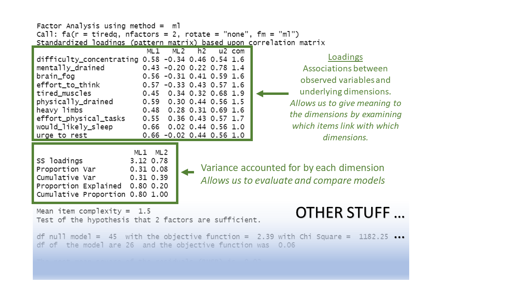

```{r}
#| echo: false
set.seed(8839)
eg2 = lavaan::simulateData(
  "l1 =~ .8*item1+.6*item2+.75*item3+.9*item4+.3*item9 + .6*item10
  l2 =~ .7*item5+.8*item6+.7*item7+.75*item8+.6*item9+.3*item10
  l1~~.5*l2
  l1~~1*l1
  l2~~1*l2"
)
tiredq <- apply(eg2, 2, \(x) as.numeric(cut(x,9)))[,c(1:4,7:10,5:6)] |> as.data.frame()
names(tiredq) <- c("difficulty_concentrating",
          "mentally_drained",
          "brain_fog",
          "effort_to_think",
          "tired_muscles",
          "physically_drained",
          "heavy limbs",
          "effort_physical_tasks",
          "would_likely_sleep",
          "urge to rest")
```


## Model based thinking

It's worth noting that exploratory factor analysis is a model-based approach to dimension reduction. This differs subtly from something like PCA which is more like a calculation or 're-expression'.  

At a very broad level, most of statistical modelling is of the form:  

$$
\text{Outcome} = \text{Model} + \text{Error}
$$

Typically with methods we have looked at before such as `lm()` and `lmer()`, the "outcome" was a vector of everybody's values on an outcome variable, which we predict (or 'model') based on the values on a set of explanatory variables.  

What changes when we do factor analysis is that **our "outcome" is going to be a covariance matrix.**
This covariance matrix represents how the items that we've collected data for co-vary with one another.

::: {.callout-tip collapse="true"}
#### optional: what's "covariance" again?

**Intuition:**

You can think of the covariance of Item A and Item B as follows: If you already know the values of Item A, how well can you guess the values of Item B?

- If responses to Item B are generally high when responses to Item A are also high, then the two items have positive covariance.
- If responses to Item B are generally low when responses to Item A are high, then the two items have negative covariance.
- If responses to Item B are all over the place when responses to Item A are high, then the two items have near-zero covariance.


**Concretely:**

Let's look back at our data on mental fatigue (M), physical fatigue (P), and sleepiness (S).
We'll plot physical fatigue against mental fatigue.

```{r}
mydata |>
  ggplot(aes(x = P, y = M)) +
  geom_point()
```

This plot shows a positive association: 

- low P co-occurs with low M, and not with high M; 
- high P co-occurs with high M, and not with low M.

In other words: if you've observed a high value of P, you can be fairly confident that you'll also observe a high value of M.
This suggests that P and M co-vary in the positive direction.

Let's check.

```{r}
cov(mydata$P, mydata$M)
```

Yes! The covariance is positive.

<br>

**Why is covariance different from correlation?**

Covariance is on the scale of the original variable. 
The 1.4 units of covariance between physical fatigue and mental fatigue represent 1.4 points on the original scale with which the data was gathered.

Just like standard deviations are a standardised version of variance, you can think of correlations as a standardised version of covariance.
Correlations are standardised to only take on values between –1 and 1, no matter what the original scale of the data was.

:::

The goal of an EFA model is to figure out what factors might underlie our data.
It maps each item we observe onto each of the factors that we tell the model to find.
The associations between each item and the factor are called "factor loadings".
**The "model" is going to be some function of our factor loadings, and the "error" is going to be the 'how far off is the model from the outcome?'**

Let's make this a bit more concrete.
In the tiredness example from above, we have ten observed variables, so our covariance matrix would be 10x10: ten rows by ten columns.
But to keep things reasonable, we'll look at an example below with just three observed variables, meaning that we have a 3x3 covariance matrix.

In our example with the 3x3 covariance matrix, we've decided that we'll model these items with just one factor.
Our three variables each have one loading onto the single factor, so our model is represented by three numbers: the loadings of each variable onto the factor.
We're using the symbol $\mathbf{\Lambda}$, which is a capital lambda, to denote those three numbers.

(If you've never encountered linear algebra before, don't worry about how exactly the following maths happens.
The equations are included for those who are interested—if you're not interested, that's OK.
The maths is not essential for you to know.)

We multiply those three numbers $\mathbf{\Lambda}$ by themselves in such a way that the outcome is a 3x3 matrix.^[In linear algebra terms, $\mathbf{\Lambda}$ is a column vector and $\mathbf{\Lambda'}$ is a row vector, and using matrix multiplication, their product $\mathbf{\Lambda}\mathbf{\Lambda'}$ is a 3x3 matrix.]
This matrix is *close* but not quite identical to our observed covariance matrix.
The difference between the model matrix and the covariance matrix is the uniqueness matrix, represented by $\mathbf{\Psi}$, a capital psi (pronounced like "sigh").
The uniqueness matrix contains the "error", the variance that's unique to each observed item (whether because the item is different in some way than the others, or because there's measurement error associated with that item, or both—examples of this coming up below).

```{r}
#| include: false
library(rgl)
library(psych)
set.seed(4)
R = matrix(c(1,.6,.8,
             .6,1,.8,
             .8,.8,1),nrow=3)
Sigma = diag(3)%*%R%*%diag(3)
Mean <- rep(0,3)
x <- MASS::mvrnorm(500, Mean, Sigma)
x <- apply(x,2,\(x) as.numeric(cut(x,9)))
mydata <- as.data.frame(x)

names(mydata) <- c("M","P","S")
ll = fa(mydata, nfactors=1,rotate="none")$loadings[,1]
uu = fa(mydata, nfactors=1,rotate="none")$uniqueness
cor(mydata) |> round(2)
round(ll %*% t(ll), 2)
```

$$
\begin{align}
\color{red}
\text{Outcome} &= \color{blue} \text{Model}\, +\, \color{magenta} \text{Error}  \\
\quad \\
\color{red} \text{Covariance Matrix} &= \color{blue} \text{Factor Loadings}^2 \,+\, \color{magenta} \text{Uniqueness} \\
\quad \\
\color{red} \mathbf{\Sigma} &= \color{blue} \mathbf{\Lambda}\mathbf{\Lambda'} \,+\, \color{magenta} \mathbf{\Psi}   \\
\quad \\
\color{red}
\begin{bmatrix}
   1 & 0.22 & 0.44 \\
0.22 &    1 & 0.35 \\
0.44 & 0.35 &    1 \\
\end{bmatrix} &= 
\color{blue}
\begin{bmatrix}
0.520 \\ 0.415 \\ 0.854 \\
\end{bmatrix}
\begin{bmatrix}
0.520 & 0.415 & 0.854 \\
\end{bmatrix} \,+\,
 \color{magenta} 
\begin{bmatrix}
0.73 & 0 & 0  \\
0 & 0.83 & 0 \\
0 & 0 & 0.27 \\
\end{bmatrix} \\
\quad \\
 &= 
  \color{blue} 
\begin{bmatrix}
0.27 & 0.22 & 0.44 \\
0.22 & 0.17 & 0.35 \\
0.44 & 0.35 & 0.73 \\
\end{bmatrix} \,+\,
  \color{magenta} 
\begin{bmatrix}
0.73 & 0 & 0  \\
0 & 0.83 & 0 \\
0 & 0 & 0.27 \\
\end{bmatrix} \\
\end{align}
$$


Suppose our three variables were all questions about anxiety. For agreement with a statement like like "I struggle to say still and am often fidgeting", people will vary in their responses due to 1) their level of anxiety, 2) their general fidgeting behaviours that are separate from their anxiety, and 3) measurement error (responses of "agree" and "strongly agree" are very inexact measurements here!)

Factor analysis is concerned with the first of these - the variance shared across multiple items. So a way to think of the factor model is as trying to separate out common variance from unique variance (which could be 'true' variability or just error):    

$$
\begin{equation}
var(\text{total}) = var(\text{common}) + var(\text{specific}) + var(\text{error})
\end{equation}
$$

 
| | | |
|-|-|-|
|common variance | variance shared across items | true and shared | 
|specific variance | variance specific to an item that is not shared with any other items | true and unique | 
| error variance | variance due to measurement error | not 'true', unique |


## Factor extraction methods   

In EFA, the process of identifying how our variables map onto some number of factors is called "factor extraction".
It's like how, in linear modelling, the process of identifying the values of the intercept and the slope is called "coefficient estimation".
In linear modelling, we also saw that there are a few different ways to estimate coefficients (e.g., using different optimisers).
And similarly, in EFA, there are a few different ways to extract factors.

We're not going to delve too much into factor extraction methods here, beyond mentioning the top three choices below and when you might use them.


PCA (using eigendecomposition) is itself a method of extracting different dimensions from our data.
But PCA isn't really factor analysis, because factor analysis focuses on *interpreting* the factors we extract.
So, in factor analysis, the main contenders are **Maximum Likelihood (ml)**, **Minimum Residuals (minres)** and **Principal Axis Factoring (paf)**.  

**Maximum Likelihood** has the benefit of providing standard errors and fit indices that are useful for model testing, but the disadvantage is that it is sensitive to violations of normality, and can sometimes fail to converge, or produce solutions with impossible values such as factor loadings >1 (known as "Heywood cases"), or factor correlations >1.  
**Minimum Residuals (minres)** and **Principal Axis Factoring (paf)** will both work even when maximum likelihood fails to converge, and are slightly less susceptible to deviations from normality. They are a bit more sensitive to the extent to which the observed variables share variance with one another.  


You can find a lot of discussion about different methods both in the help documentation for the `fa()` function from the psych package, and there are lots of discussions both in papers and on [forums](https://stats.stackexchange.com/questions/50745/best-factor-extraction-methods-in-factor-analysis). This is a complicated issue, but when you have a large sample size, a large number of items, for which each has a similar amount of shared variance, then the extraction methods tend to agree. Don't fret too much about the factor extraction method.

## Rotations

```{r}
#| echo: false
mn = fa(tiredq, nfactors=2, rotate = "none", fm="ml")
mr = fa(tiredq, nfactors=2, rotate = "varimax", fm="ml")
mor = fa(tiredq, nfactors=2, rotate = "oblimin", fm="ml")

x_axis <- c(1, 0)
y_axis <- c(0, 1)
new_x_axis <- mr$rot.mat %*% x_axis
new_y_axis <- mr$rot.mat %*% y_axis
newo_x_axis <- (mor$rot.mat %*% mor$Phi) %*% x_axis
newo_y_axis <- (mor$rot.mat %*% mor$Phi) %*% y_axis
original_axes <- data.frame(
  x = c(0, x_axis[1], 0, y_axis[1]),
  y = c(0, x_axis[2], 0, y_axis[2]),
  axis = c("Original X", "Original X", "Original Y", "Original Y")
)
rotated_axes <- data.frame(
  x = c(0, new_x_axis[1], 0, new_y_axis[1]),
  y = c(0, new_x_axis[2], 0, new_y_axis[2]),
  axis = c("Rotated X", "Rotated X", "Rotated Y", "Rotated Y")
)
orotated_axes <- data.frame(
  x = c(0, newo_x_axis[1], 0, newo_y_axis[1]),
  y = c(0, newo_x_axis[2], 0, newo_y_axis[2]),
  axis = c("Rotated X", "Rotated X", "Rotated Y", "Rotated Y")
)

p1 <- mn$loadings[,1:2] |>
  as.data.frame() |>
  rownames_to_column() |>
  ggplot(aes(x=ML1,y=ML2))+
  geom_point()+
  geom_vline(xintercept=0,size=1)+
  geom_hline(yintercept=0,size=1)+
  geom_text(aes(label=rowname),hjust=-.2)+
  # geom_segment(aes(xend=0,yend=ML2),lty="dashed",
  #              alpha=.6)+
  # geom_segment(aes(yend=0,xend=ML1),lty="dashed",
  #              alpha=.6)+
  labs(x="Loadings on Factor 1",
       y="Loadings on Factor 2")+
  xlim(-1,1)+ylim(-1,1)+
  geom_segment(data = original_axes, aes(x = 0, y = 0, xend = x, yend = y, color = axis), 
               arrow = arrow(length = unit(0.2, "cm")), size = 1) +
  geom_segment(data = original_axes, aes(x = 0, y = 0, xend = -x, yend = -y, color = axis), 
               arrow = arrow(length = unit(0.2, "cm")), size = 1) +
  scale_colour_manual(values = c('#f8766d', '#7cae00'))
  
p2 <- mn$loadings[,1:2] |>
  as.data.frame() |>
  rownames_to_column() |>
  ggplot(aes(x=ML1,y=ML2))+
  geom_point()+
  geom_vline(xintercept=0,size=1)+
  geom_hline(yintercept=0,size=1)+
  geom_text(aes(label=rowname),hjust=-.2)+
  # geom_segment(aes(xend=0,yend=ML2),lty="dashed",
  #              alpha=.3)+
  # geom_segment(aes(yend=0,xend=ML1),lty="dashed",
  #              alpha=.3)+
  xlim(-1,1)+ylim(-1,1)+
  geom_segment(data = original_axes, aes(x = 0, y = 0, xend = x, yend = y, color = axis), 
               arrow = arrow(length = unit(0.2, "cm")), size = 1) +
  geom_segment(data = original_axes, aes(x = 0, y = 0, xend = -x, yend = -y, color = axis), 
               arrow = arrow(length = unit(0.2, "cm")), size = 1) +
  geom_segment(data = rotated_axes, aes(x = 0, y = 0, xend = x, yend = y, color = axis), 
               linetype = "dashed", arrow = arrow(length = unit(0.2, "cm")), size = 1) +
  geom_segment(data = rotated_axes, aes(x = 0, y = 0, xend = -x, yend = -y, color = axis), 
               linetype = "dashed", arrow = arrow(length = unit(0.2, "cm")), size = 1) +
  labs(x="Loadings on Factor 1",
       y="Loadings on Factor 2")

p3 <- mn$loadings[,1:2] |>
  as.data.frame() |>
  rownames_to_column() |>
  ggplot(aes(x=ML1,y=ML2))+
  geom_point()+
  geom_vline(xintercept=0,size=1)+
  geom_hline(yintercept=0,size=1)+
  geom_text(aes(label=rowname),hjust=-.2)+
  # geom_segment(aes(xend=0,yend=ML2),lty="dashed",
  #              alpha=.3)+
  # geom_segment(aes(yend=0,xend=ML1),lty="dashed",
  #              alpha=.3)+
  labs(x="Loadings on Factor 1",
       y="Loadings on Factor 2")+
  xlim(-1,1)+ylim(-1,1)+
    geom_segment(data = original_axes, aes(x = 0, y = 0, xend = x, yend = y, color = axis), 
               arrow = arrow(length = unit(0.2, "cm")), size = 1) +
  geom_segment(data = original_axes, aes(x = 0, y = 0, xend = -x, yend = -y, color = axis), 
               arrow = arrow(length = unit(0.2, "cm")), size = 1) +
  geom_segment(data = orotated_axes, aes(x = 0, y = 0, xend = x, yend = y, color = axis), 
               linetype = "dashed", arrow = arrow(length = unit(0.2, "cm")), size = 1) +
  geom_segment(data = orotated_axes, aes(x = 0, y = 0, xend = -x, yend = -y, color = axis), 
               linetype = "dashed", arrow = arrow(length = unit(0.2, "cm")), size = 1) 

```

A much more conceptual part of factor analysis that we need to devote some time to is the idea of "rotations".  

<!-- Recall that there are often two main aspects of the dimensions that we are quantifying:  -->

<!-- 1. the amount of the total variance that is captured by the dimensions -->
<!-- 2. the relationship between each measured variable and each of the dimensions.   -->

Think back to scaling predictors in a linear model, or choosing different contrast coding schemes.
If we convert a continuous predictor to z-scores, or use either dummy coding or effect coding for a categorical predictor, then all that will change between versions of the model is the model's coefficients.
The data itself does not change, and crucially, the predictions that the model makes (e.g., if you use `predict()` or `emmeans()`) also do not change.
All that changes is the model's internal representation of things.

In a similar way, in EFA, we can transform the set of relationships between measured variables and factors (i.e., transform the set of loadings) without changing what the model predicts.^[In fact, there are infinitely many kinds of transformations that we could apply that would all result in models which make identical predictions!
This idea is called "rotational indeterminacy".]

Transforming predictors is about _interpretation_: transforming predictors can make the model's coefficients easier to interpret.
In linear modelling, we might choose effect coding instead of dummy coding because we want to compare one group to the grand mean, rather than comparing one group to another group.
In a similar way, to make factor loadings easier to interpret, we may wish to rotate them.

Let's return to our tiredness example, where we had ten questions about tiredness and extracted two factors.
(Notice that the factor extraction method used here is "ml", maximum likelihood.)
Based on the factor loadings, which in principle can range from –1 to 1, how would we interpret the dimensions represented by the first factor (`ML1`) and the second factor (`ML2`)?

```{r}
#todo read_csv()
tired_fa1 <- fa(tiredq, nfactors=2, rotate = "none", fm="ml")
print(tired_fa1$loadings, cutoff = .3)
```

(Some of the cells in the table are blank.
They're not shown because they contain loadings that are close enough to zero that we deem them uninteresting.
We defined our near-zero cutoff at 0.3.
So only loadings more negative than –0.3 or more positive than 0.3 are shown.)

The first factor is associated fairly highly with all 10 variables.
So maybe it represents a scale of "general fatigue"?

The second factor is even less clear.
It only has loadings above 0.3 for three items: it's negatively associated with mental fatigue, and positively associated with physical fatigue.
The resulting scale is kind of awkward to describe: at one end of this scale, you're physically fatigued but not mentally, and at the other end of this scale, you're mentally fatigued but not physically.
It's not the clearest idea, especially as when we introduced these questions we actually had a clearer notion (i.e., some questions about mental fatigue, some questions about physical fatigue, and a couple of others)

And this is where **rotation** comes in. We can transform those sets of loadings in such a way that aims to make each variable load high on to one factor and low on to other factors, without changing the amount of variability we're explaining.  
The result will be factors that are much easier to interpret.

One way to *see* this rotation is to start by plotting the loadings for each variable on to each factor: @fig-biplot-none (this is only really possible here because we have just two factors, ML1 on the x axis and ML2 on the y axis).
All ten variables are positively loaded on Factor 1, and they're split between positive and negative on Factor 2.

```{r}
#| echo: false
#| label: fig-biplot-none
#| fig-cap: "Loadings of each variable onto the two factors (no rotation)"
p1 + labs(title="No Rotation") + coord_fixed()
```

Now, let's see what happens if we rotate these axes, as in @fig-biplot-orth.
Tilt your head 45 degrees to the right to understand this plot: the dashed purple line is the new y axis (the new "vertical"), and the dashed cyan line is the new x axis (the new "horizontal").
Now, the physical fatigue variables are high on the purple axis, while the mental fatigue variables are high on the cyan axis.
Thus, each axis can be more easily interpreted with respect to the variables that load highly on it.
We have one factor that seems to represent mental fatigue + sleepiness, and another factor that seems to represent physical fatigue + sleepiness.  

```{r}
#| echo: false
#| label: fig-biplot-orth
#| fig-cap: "Loadings of each variable onto the two factors (orthogonal rotation)"
p2 + labs(title="Orthogonal Rotation") + coord_fixed()
```

The total variance explained by this rotated solution is just the same as our unrotated solution.
We can see this when we run the following R code, where the "varimax" rotation gives us the orthogonal rotation visualised above.
Before, the cumulative variance explained after two factors was 0.366 (you can scroll up to double-check), and below, we see that the cumulative variance explained after two factors is still 0.366, even with the rotation.
This number tells us that together, these two factors capture 36.6% of the total variance in our data.

```{r}
tired_fa2 <- fa(tiredq, nfactors=2, rotate = "varimax", fm="ml")
print(tired_fa2$loadings, cutoff = .3)
```

Look at the orthogonal rotation plot again below.
When two lines are orthogonal, they are at 90 degrees to one another—that's what "orthogonal" means.
Our starting X and Y axes were orthogonal to one another, and when we choose an orthogonal rotation, our new axes are still orthogonal to one another.

```{r}
#| echo: false
#| label: fig-biplot-orth2
#| fig-cap: "Loadings of each variable onto the two factors (orthogonal rotation)"
p2 + labs(title="Orthogonal Rotation") + coord_fixed()
```


Requiring that the axes be orthogonal means that we're insisting that there is no correlation between the two factors.
In other words, we assume that if someone is high on the mental fatigue dimension, we would have absolutely no idea whether they're high or low on the physical fatigue dimension.
But this feels weird!
Surely we'd expect mental and physical fatigue to be correlated?

We can allow factors to be correlated by relaxing the constraint about orthogonal axes.
Instead of choosing an orthogonal rotation, we use what's called an "oblique rotation".
In R code, this means choosing the rotation method "oblimin".
The idea is much the same as the "orthogonal rotation" above, but we don't have to keep the right angle between the factors:

```{r}
#| echo: false
#| label: fig-biplot-obl
#| fig-cap: "Loadings of each variable onto the two factors (oblique rotation)"
p3 + labs(title="Oblique Rotation") + coord_fixed()
```


The pattern of factor loadings that emerges now is a lovely clean structure!
Each variable is clearly linked to one factor and not as much to the other: for each item, there is only one loading above our cutoff of 0.3.
And we've let the factors be correlated – so for someone who is high on factor 1 (which now looks like the 'physical fatigue' factor) we would also expect them to be high on factor 2 ('mental fatigue').  

```{r}
tired_fa3 <- fa(tiredq, nfactors=2, rotate = "oblimin", fm="ml")
print(tired_fa3$loadings, cutoff = .3)
```

In this situation, we also get out the correlation between the factors.^[If you're a trigonometry fan (I'm not!), the correlation between factors is the cosine of the angle between the axes!]
We can extract the specific values using:

```{r}
tired_fa3$Phi
```


:::sticky
__Rotations & Simple Structures__  

The idea of rotations in EFA is ultimately to help us get to a solution that "makes more sense".  

**Important Note:** "makes more sense" here is largely a theory driven idea. We need to think whether the proposed sets of factor loadings fit with what we know about the variables (how they're worded etc) and the underlying construct that we are trying to measure.  

In the discussion of rotations above, we talked about a 'cleaner' solution - where each variable tends to have one high loading and the other loadings are small. In essence we are trying to make a pattern that looks a bit like this, in diagrammatic form:  

```{r}
#| echo: false
#| out-width: "100%"
knitr::include_graphics("images/diag_efa2.png")
```

This idea is typically referred to as a **"simple structure"**, where each variable is "univocal" (it speaks to one factor only, and not to the others). This simplifies the interpretation of factors, making them more distinct and more easily understandable.  


| type                | common methods | what happens &nbsp;&nbsp;&nbsp;&nbsp;&nbsp;&nbsp;&nbsp;&nbsp;&nbsp;&nbsp; |
| ------------------- | ---------------| ------------------------------ |
| no rotation         | rotate = "none"   | Tries to maximise loadings on to the first factor       |
| orthogonal rotation | rotate = "varimax"                      | Keeping factors uncorrelated (orthogonal), tries to maximise the variance of loadings (i.e. have lots of high loadings and lots of low loadings) |
| oblique rotation    | rotate = "oblimin"<br>rotate = "promax" | Tries to find a balance between a simple factor structure and the degree of correlation between factors |
 
:::

::: {.callout-caution collapse="true"}
#### Optional: Explanation with matrices

TODO 

- 5x5 matrix, 2 factors, lambda phi lambda'
```{r}
set.seed(07)
RR = matrix(c(1,.5,.5,.2,.2,
              .5,1,.5,.2,.2,
              .5,.5,1,.2,.2,
              .2,.2,.2,1,.5,
              .2,.2,.2,.5,1), nrow=5)
tdf = MASS::mvrnorm(2e2,mu=c(0,0,0,0,0),Sigma=RR)
cor(tdf) |> round(2)

ll = fa(tdf, nfactors=2,rotate="none")$loadings[,1:2]
uu = fa(tdf, nfactors=2,rotate="none")$uniqueness


ll_orth = fa(tdf, nfactors=2,rotate="varimax")$loadings[,1:2]
ll_obl = fa(tdf, nfactors=2,rotate="oblimin")$loadings[,1:2]
phi_obl = fa(tdf, nfactors=2,rotate="oblimin")$Phi

cor(tdf) |> round(2)
round( ll %*% t(ll), 2)
round( ll_orth %*% t(ll_orth), 2)
round( ll_obl %*% phi_obl %*% t(ll_obl), 2)
```


Furthermore, we could relax the constraint that these sets of loadings are 'orthogonal', and add in another 


:::


# The fa() Output

Now that we've got a rough sense of the idea of factor analysis and rotations, we can take a closer look at the output that we get in R.  

we can simply print the name of our model in order to see **a lot** of information. Below are a series of slides (the full deck as a .pdf is [here if you want it](https://uoepsy.github.io/lv/misc/efa_output.pdf){target="_blank"}) that step-by-step talk through each part of the output of an EFA.  

```{r}
#| include: false
file.copy("images/efa_output.pdf","../docs/misc/")
```


<!-- EP NOTE: The Pattern Matrix and Communalities boxes make reference to the "structure matrix", which isn't mentioned/defined anywhere else. Probably add a box on it too? -->

::: {.callout-tip collapse="true"}
#### Pattern Matrix

```{r}
#| echo: false
#| out-width: "100%"
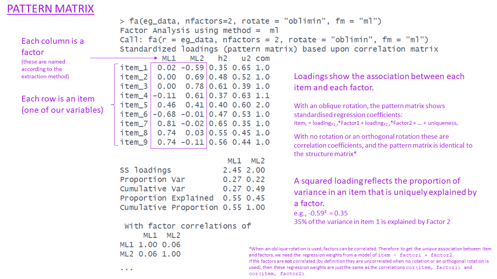
```

:::

::: {.callout-tip collapse="true"}
#### Communalities

```{r}
#| echo: false
#| out-width: "100%"
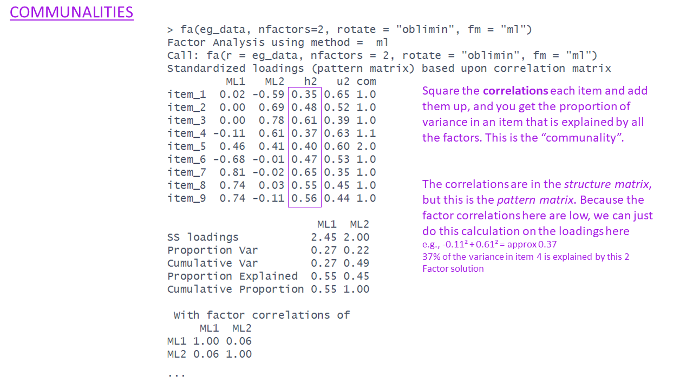
```

:::

::: {.callout-tip collapse="true"}
#### Uniqueness

```{r}
#| echo: false
#| out-width: "100%"
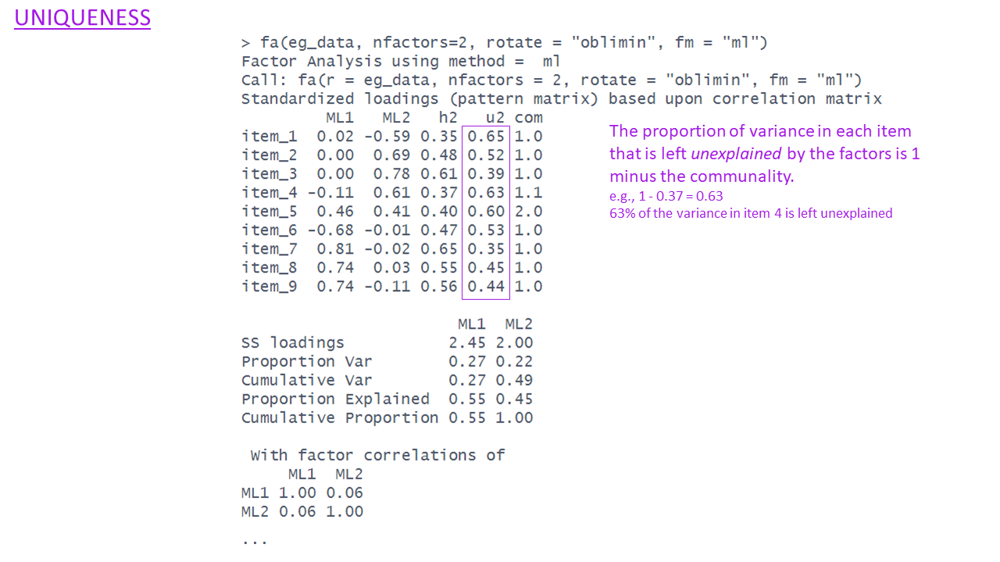
```

:::

::: {.callout-tip collapse="true"}
#### Complexities

```{r}
#| echo: false
#| out-width: "100%"
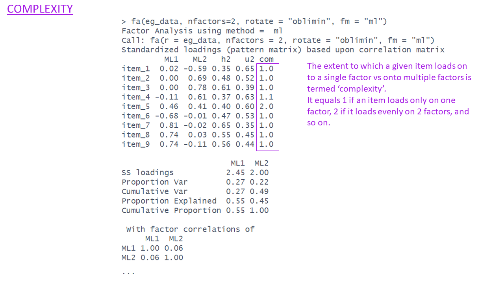
```

:::

::: {.callout-tip collapse="true"}
#### SS loadings & Variance Accounted for

```{r}
#| echo: false
#| out-width: "100%"
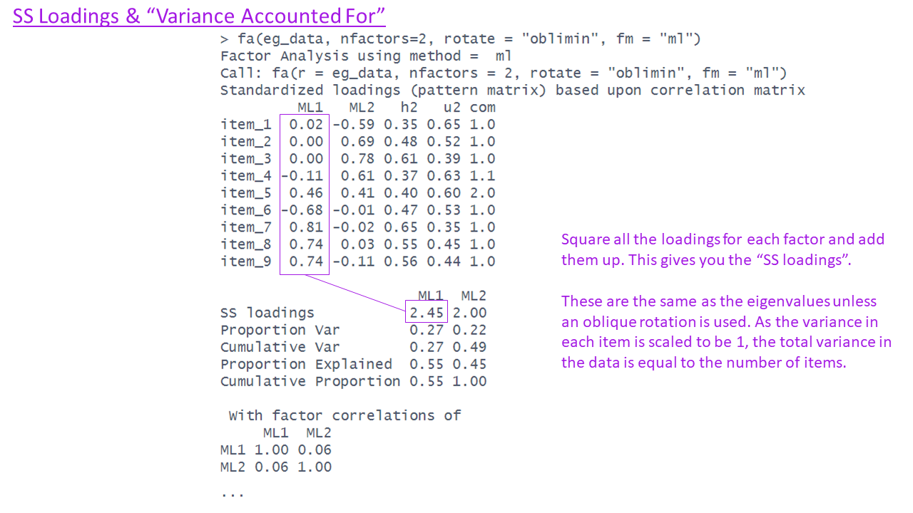
```

```{r}
#| echo: false
#| out-width: "100%"
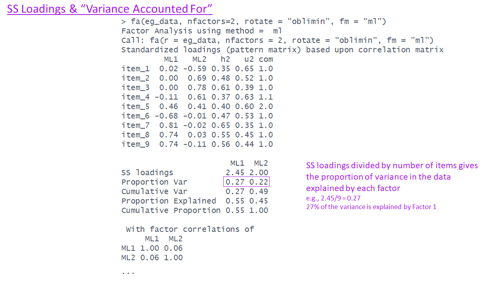
```

```{r}
#| echo: false
#| out-width: "100%"
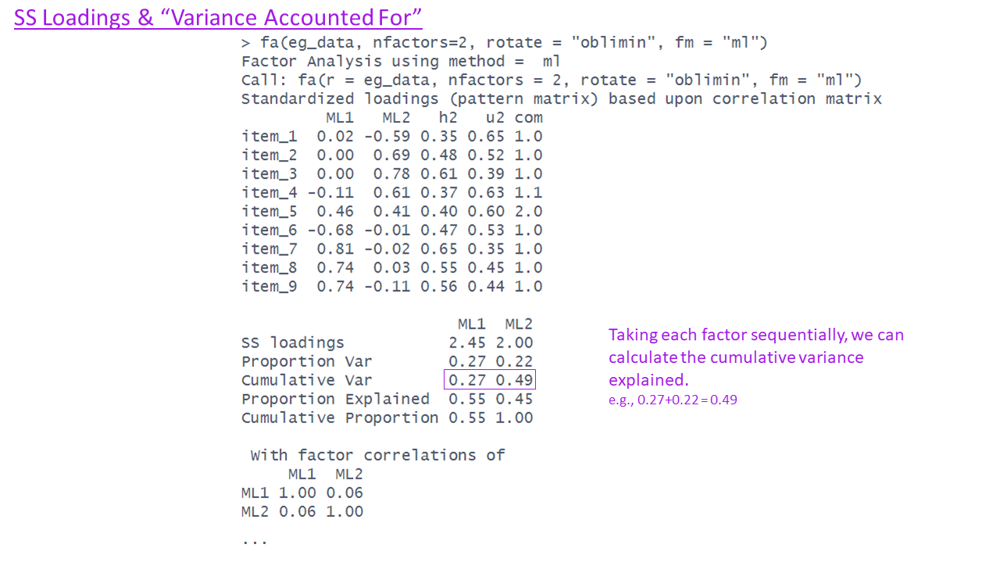
```
```{r}
#| echo: false
#| out-width: "100%"
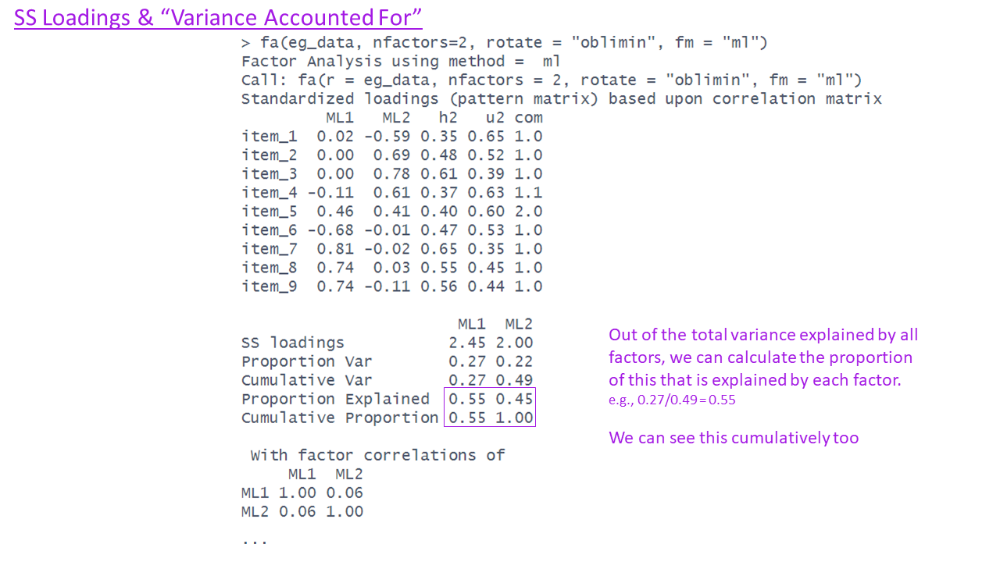
```
:::


::: {.callout-tip collapse="true"}
#### Factor Correlations
```{r}
#| echo: false
#| out-width: "100%"
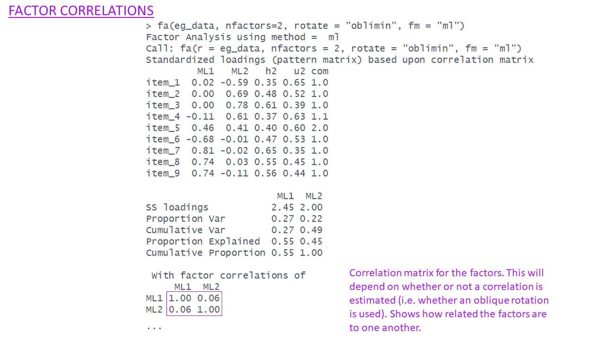
```

:::

::: {.callout-tip collapse="true"}
#### Optional Extras: Fit indices etc.  

```{r}
#| echo: false
#| out-width: "100%"
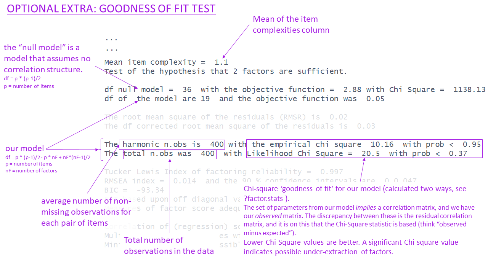
```
```{r}
#| echo: false
#| out-width: "100%"
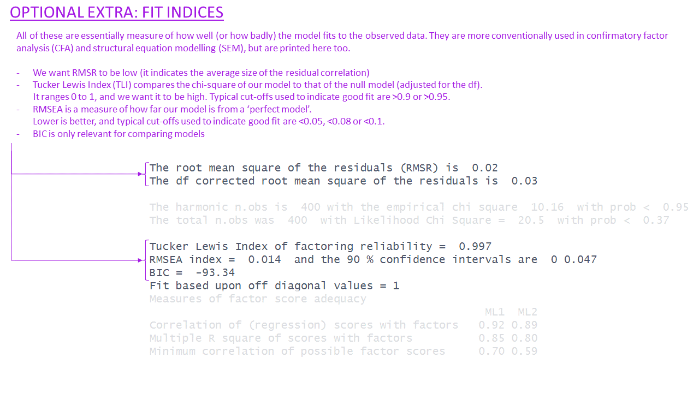
```
```{r}
#| echo: false
#| out-width: "100%"
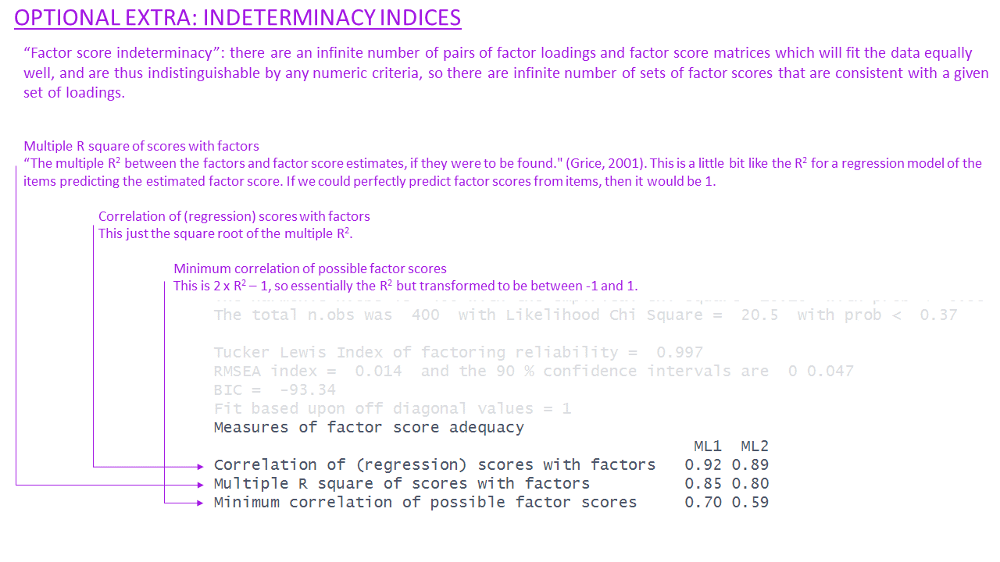
```

:::

# What makes a good factor solution?  

Recall again the rough steps of EFA we introduced earlier. Note that this exploratory method will typically involve fitting multiple EFA models for a range of possibly numbers of factors, and then comparing and evaluating them with regards to which is most theoretically coherent.    

:::frame
**The process of EFA:**  

1. check suitability of items
2. decide on appropriate rotation and factor extraction method
3. examine plausible number of factors
4. based on 3, choose the range to examine from $n_{min}$ factors to $n_{max}$ factors
5. do EFA, extracting from $n_{min}$ to $n_{max}$ factors. Compare each of these 'solutions' in terms of structure, variance explained, and --- by examining how the factors from each solution relate to the observed items --- assess how much theoretical sense they make.  
6. _if the aim is to develop a scale for future use_ - consider removing "problematic" items and start over again.

:::

There are various sets of criteria proposed to set out what makes a certain factor solution "theoretically coherent".  

Ultimately, a big part of it is subjective, and based on what we know about the observed variables (e.g., if it's a questionnaire, then our interpretation of the wording of each question is key here). However, there are some key things to consider that relate to the utility of a factor solution:  


- how much variance is accounted for by a solution?
    - this is a good starting point as it shows us an overall metric of how much the factor(s) are actually capturing something that is meaningfully shared between the items. 
    - more variance in the items explained by the solution is better, but more factors will always explain more variance.  
- do all factors load on 3+ items at a "salient" level?  
    - "salient" here is somewhat arbitrary, but convention uses loadings that are $>0.3$ or $<-0.3$
    - we want our factors to be meaningful things that don't simply represent the same thing as a single variable. If a factor has only 1 item that loads very highly on to it, and all other item loadings are small, then that factor is really just capturing a very similar thing to the observed item.  
- do all items have at least one loading at a salient level?  
    - we want our solution to capture the full breadth of our scale - i.e. all aspects of our construct. So we ideally want each item to be related to at least one factor.
    - depending on our purpose here, an item that doesn't have a high loading could point us to look at the item in more detail, and think about _why_ it is doing something different. If we are developing a scale then we may even decide that the item was badly worded, and we could drop it from the analysis and start over with the process on the subset of items.  
- are there any highly complex items?  
    - we ideally want items to be linked mainly to one factor and not to others.
    If an item loads across multiple factors, then we say that item is "complex".
 This isn't necessarily a problem per se, but it can make it harder to define exactly what our factors represent.  
- are there any "Heywood cases" (communalities or standardised loadings that are >1)?  
    - this can happen if we use maximum likelihood as an estimation technique, and we should check for these because they reflect that the solution may fit well numerically, but make absolutely no sense (you can't have correlations >1).  
- is the factor structure (items that load on to each factor) coherent, and does it make theoretical sense?
    - this is possibly the biggest question. Broadly speaking, it is asking "can you give a name to each factor?". It requires us looking at the item wordings carefully and considering how they are grouped in loadings on to each factor. This is the fun bit!  


# Demonstration: EFA in practice

:::frame
__Dataset: phoneaddiction.csv__  

The dataset at [https://uoepsy.github.io/data/phoneaddiction.csv](https://uoepsy.github.io/data/phoneaddiction.csv){target="_blank"} comes from a (fake) study that is interested in developing a scale of "phone-attachment/addiction" - i.e., the idea of being overly attached to a phone.  

We have a set of 10 statements (@tbl-phdict) that get at different aspects of this idea, and we asked 240 people to rate how much they agreed with each of the 10 statements on a 1-5 scale (1 = strongly disagree, 5 = strongly agree).

```{r}
phdat <- read_csv("https://uoepsy.github.io/data/phoneaddiction.csv")
```


```{r}
#| echo: false
#| label: tbl-phdict
#| tbl-cap: "Item wordings for phoneaddiction.csv"
itemqs = c("I often reach for my phone even when I don't have a specific reason to use it.",
"I feel a strong urge to check my phone frequently, even during meals or social interactions.",
"I spend a large portion of my day using my phone, often for more hours than I intend.",
"My phone use has interfered with my ability to complete tasks or responsibilities at school, work, or home.",
"When I cannot use my phone (e.g., no battery or no signal), I feel anxious or uncomfortable.",
"My phone use has negatively affected my sleep schedule, such as staying up late scrolling.",
"I find it difficult to avoid checking my phone immediately upon waking up or right before bed.",
"I often check my phone even in situations where it's distracting or socially inappropriate (e.g., meetings or classes).",
"I sometimes feel that others are overly concerned about my phone use in social situations.",
"I have tried to reduce my phone usage but find it challenging to do so.")

m = "
 lv1 =~ .8*item1 + .8*item2 + .8*item3 + .8*item7 + .8*item8 + .1*item9
 lv2 =~ .8*item4 + .8*item5 + .8*item6 + .2*item9 + .8*item10
 lv1 ~~ .5*lv2
"
set.seed(2345)
df = lavaan::simulateData(m,sample.nobs = 240)
df = apply(df, 2, \(x) as.numeric(cut(x,5))) |> as_tibble()
df = df |> select(paste0("item",1:10))
phdat <- df
# write_csv(phdat, file="../../data/phoneaddiction.csv")

tibble(
  variable = names(df),
  question = itemqs
) |> gt::gt()

```
:::


## 1. Initial checks

There are various ways of assessing the suitability of our items for exploratory factor analysis, and most of them rely on examining the observed correlations between items.  


::: {.callout-note collapse="true"}
#### Look at the correlation matrix  

Use a function such as `cor` or `corr.test(data)` (from the **psych** package) to create the correlation matrix. If it's a big matrix (they get big quite quickly!) then we can make some sort of visual to get a better sense.  


__phoneaddiction.csv example:__  
Most of the correlations are in the range from 0.2 to 0.4. So they aren't hugely strong correlations, but they _are_ all related. From the plot below item9 already looks to be a weird one, which is something to keep in mind.  

```{r}
library(pheatmap)
pheatmap(cor(phdat), cluster_rows = F, cluster_cols = F)
```

:::

::: {.callout-note collapse="true"}
#### Bartlett's Test  

The function `cortest.bartlett(cor(data), n = nrow(data))` conducts "Bartlett's test". This tests against the null that the correlation matrix is proportional to the identity matrix (a matrix of all 0s except for 1s on the diagonal).  

  - Null hypothesis: observed correlation matrix is equivalent to the identity matrix  
  - Alternative hypothesis: observed correlation matrix is not equivalent to the identity matrix.  
  
::: {.callout-note collapse="true"}
#### What is the identity matrix?

The "Identity matrix" is a matrix of all 0s except for 1s on the diagonal.  
e.g. for a 3x3 matrix:  
$$
\begin{bmatrix}
1 & 0 & 0 \\
0 & 1 & 0 \\
0 & 0 & 1 \\
\end{bmatrix}
$$
If a correlation matrix looks like this, then it means there is __no__ shared variance between the items, so it is not suitable for factor analysis.  

:::

__phoneaddiction.csv example:__  
The Bartlett test is significant here, meaning that we reject the null hypothesis that our correlation matrix is equivalent to the identity matrix.  
This is a good thing - we _want_ it to be different in order to justify doing factor analysis.  
```{r}
cortest.bartlett(phdat)
```


:::

::: {.callout-note collapse="true"}
#### Kaiser, Meyer, Olkin Measure of Sampling Adequacy  

You can check the "factorability" of the correlation matrix using `KMO(data)` (also from **psych**!).  

- Rules of thumb: 
    - $0.8 < MSA < 1$: the sampling is adequate
    - $MSA <0.6$: sampling is not adequate 
    - $MSA \sim 0$: large partial correlations compared to the sum of correlations. Not good for FA  
    
    
::: {.callout-note collapse="true"}
#### Kaiser's suggested cuts  

These are Kaiser's corresponding adjectives suggested for each level of the KMO:  

- 0.00 to 0.49 "unacceptable"  
- 0.50 to 0.59 "miserable"  
- 0.60 to 0.69 "mediocre"  
- 0.70 to 0.79 "middling"  
- 0.80 to 0.89 "meritorious"  
- 0.90 to 1.00 "marvelous"  

:::

__phoneaddiction.csv example:__  
Overall KMO is good here at 0.83, and individual item KMOs are also looking pretty 'meritorious' too! The only thorny one is item9, again!  
```{r}
KMO(phdat)
```


:::

::: {.callout-note collapse="true"}
#### Check for linearity  

It also makes sense to check for linearity of relationships prior to conducting EFA. EFA is all based on correlations, which assume the relations we are capturing are linear.  

You can check linearity of relations using `pairs.panels(data)` (also from **psych**), and you can view the histograms on the diagonals, allowing you to check univariate normality (which is usually a good enough proxy for multivariate normality). 

__phoneaddiction.csv example:__  
Because these items are measured on likert scales of 1-5, looking at scatterplots can be a bit harder. The red lines on the plots are essentially "smooth" lines, which follow the mean of the variable on the y-axis as it moves across the x-axis. So we want them to all be straight-ish, which they are.  We can see from the diagonals of this plot that the items are all fairly normally distributed too.  

```{r}
pairs.panels(phdat)
```

:::

## 2. Rotations and Factor Extraction

**Rotations:**
If we are thinking that there might be two or more factors that underly our scale of 'phone-addiction', then we would probably expect those two factors to be correlated (all the questions are about phone usage, after all). For that reason, we are going to use an **oblique rotation**.^[Even if these two factors are not correlated, then an oblique rotation could estimate that too. The point of an oblique rotation is that we're not _forcing_ the factors to be uncorrelated.]  

**Factor extraction:**
As all of the correlations between individual items are low to medium (0.2 - 0.4), and the item distributions look fairly normal, we're going to opt to use maximum likelihood here.  

## 3 & 4. How many factors?

The question of how many factors to extract is very similar to the methods discussed in the PCA demonstration in [Chapter 2#the-key-methods](02_dimension_reduction.html#the-key-methods){target="_blank"}. 


::: {.callout-note collapse="true"}
#### Scree plot 

```{r}
scree(phdat, pc = TRUE, factors = FALSE)
```

:::

::: {.callout-note collapse="true"}
#### Parallel analysis

We can set `fa = "both"` to do the parallel analysis method for both factor extraction and principal components.  

`r set.seed(33)`
```{r}
fa.parallel(phdat, fa = "both")
```

:::

::: {.callout-note collapse="true"}
#### MAP

```{r}
VSS(phdat, rotate = "oblimin", plot = FALSE, fm = "ml")
```

:::

<!-- EP TODO: What's "kaiser"? Not mentioned elsewhere. -->

| method  | suggestion |
| ------ |------ |
| kaiser |  3   |
| scree plot | 1 or 2? or 5? quite hard to tell |  
| MAP | 1 |
| parallel analysis | 2 |

From this I would say that it is worth considering both a 1 factor and a 2 factor solution.  

## 5. Doing EFA & Comparing solutions

```{r}
ph_efa1 <- fa(phdat, nfactors = 1, 
              fm = "ml")
ph_efa2 <- fa(phdat, nfactors = 2, 
              fm = "ml", rotate = "oblimin")
```

Both solutions look reasonable _apart from item 9_ (which we could have guessed right at the beginning).  
In both solutions, item 9 has smaller loadings than the other items.
The smaller the loading, the less well the item is targeting whatever construct the factor represents.


::::{.columns}
:::{.column width="48%"}
__1 factor solution__  

```{r}
print(ph_efa1$loadings, cutoff=.2)
```
:::
:::{.column width="4%"}
:::
:::{.column width="48%"}
__2 factor solution__  

```{r}
print(ph_efa2$loadings, cutoff=.2)
ph_efa2$Phi
```
:::
::::

Looking at item9, the wording is "`r itemqs[9]`" This maybe represents something slightly different from just "being addicted to your phone" - it also contains a self-consciousness / feeling judged by others etc, which is something completely different.  

So where have we got to? We started with loads of responses to a set of 10 questions, and we wanted to understand the underlying structure of the thing they were intended to measure ("phone addiction").  
We've ended by identifying one question that didn't really fit with the rest (item9), and with a question mark between whether the scale captures 2 underlying factors or just 1.

A lot of where we go next depends on what our overarching research aims are. If we want to **use** the construct "phone-addiction" in a subsequent analysis, then we'll need to extract scores, and we have a decision of what structure (1 factor or 2 factors) we want to use - and so how many scores each person will have.  

## 6 - are we doing scale development?  

If our goal here is to design a nice questionnaire for future research that captures stuff about people's addiction to their phones, then item 9 isn't proving very useful here. At this point we may also want to consider if there are any other items that are maybe redundant (it's always good to try and keep a questionnaire short to reduce participant burden!).

Removing item9, and doing the **entire** process over again, we end up still finding that it's between a 1 or a 2 factor solution. 

::: {.callout-note collapse="true"}
#### determining the number of factors  

```{r}
scree(phdat[,-9])
fa.parallel(phdat, fa = "both")
VSS(phdat, rotate = "oblimin", plot = FALSE, fm = "ml")
```

:::

::::{.columns}
:::{.column width="48%"}
__1 factor solution (excluding item 9)__  

```{r}
ph_efa1a <- fa(phdat[,-9], nfactors = 1, 
               fm = "ml")
print(ph_efa1a$loadings, cutoff = .3)
```
:::
:::{.column width="4%"}
:::
:::{.column width="48%"}
__2 factor solution (excluding item 9)__  

```{r}
ph_efa2a <- fa(phdat[,-9], nfactors = 2, 
               rotate = "oblimin", fm = "ml")
print(ph_efa2a$loadings, cutoff = .3)
ph_efa2a$Phi
```
:::
::::

Finally, we now have a judgment call. Both solutions look okay in terms of the numbers of items on each factor etc. One thing to consider is whether we prefer the idea of 1 thing that explains 28% of the variance, or 2 *related* things (the two factors are fairly correlated in the 2 factor solution) that together explain 35%. Is that a big enough increase?   

The other thing we should definitely be considering is the theoretical coherence of the solutions. The 1 factor solution is easy - we have just one factor, and that represents "addiction to your phone".  
In the 2 factor solution we need to pay more attention to which items go with which factor.  

Given the item wordings below - we might try to define Factor 1 as "frequency of use" and Factor 2 as "impact on life".  
Are these distinct enough for you? Personally I would say maybe not - some of the wordings of items in Factor 1 are still related to "impact on life" (i.e., "often for more hours than I intend"?)  

::::{.columns}
:::{.column width="48%"}
__Factor 1__  

```{r}
#| echo: false
tibble(
  variable = names(df),
  question = itemqs
)[c(1,2,3,7,8),] |> gt::gt()

```


:::
:::{.column width="4%"}
:::
:::{.column width="48%"}
__Factor 2__  

```{r}
#| echo: false
tibble(
  variable = names(df),
  question = itemqs
)[c(4,5,6,10),] |> gt::gt()
```


:::
::::

Scale development is lot of back and forth, and at this point we might consider re-wording some of the items to make the two factors more clearly distinct, then giving the edited questionnaire to a whole load of new people, and going through the whole process again until we're happy with a coherent structure!


<div class="tocify-extend-page" data-unique="tocify-extend-page" style="height: 0;"></div>

