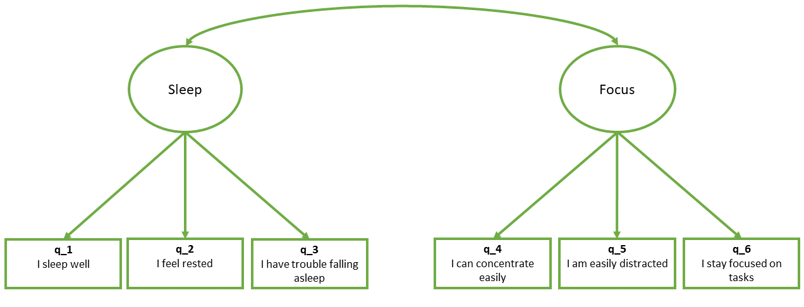
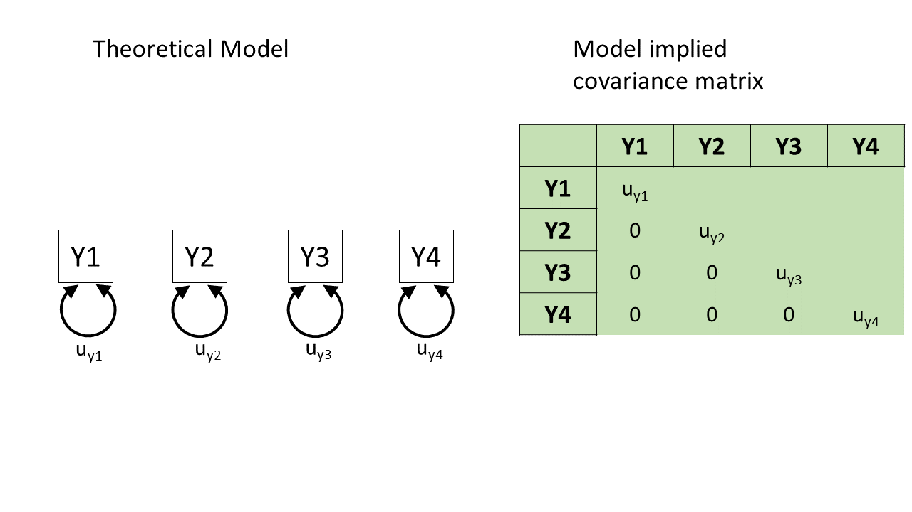
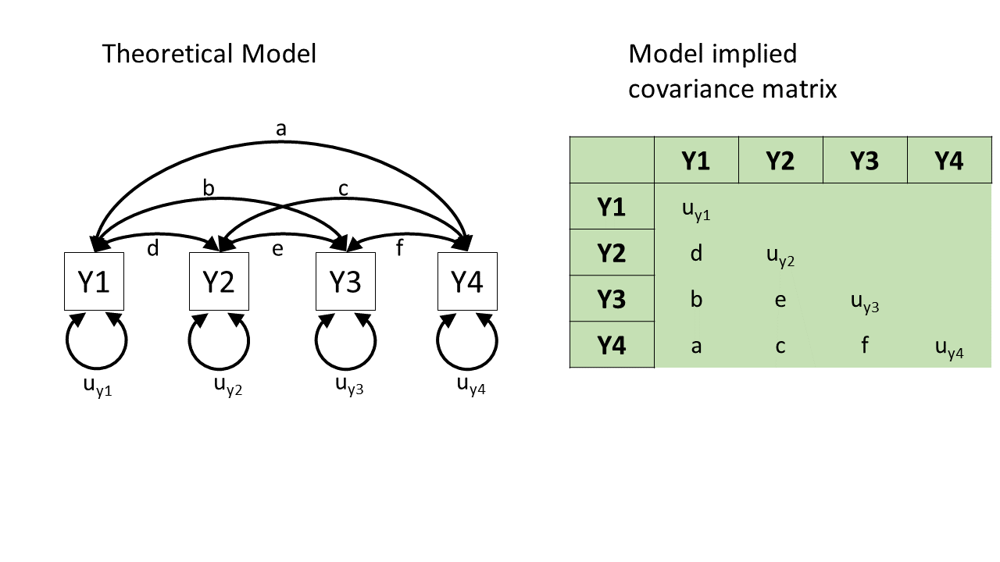
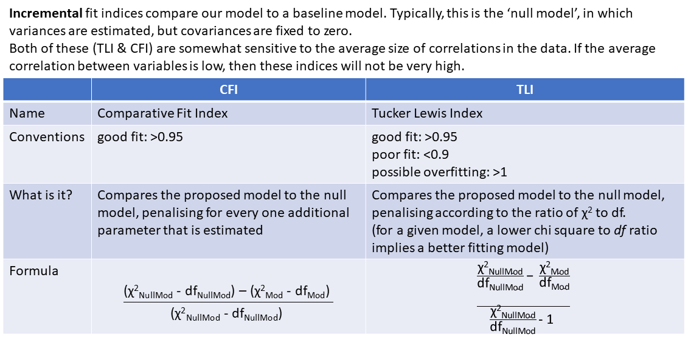
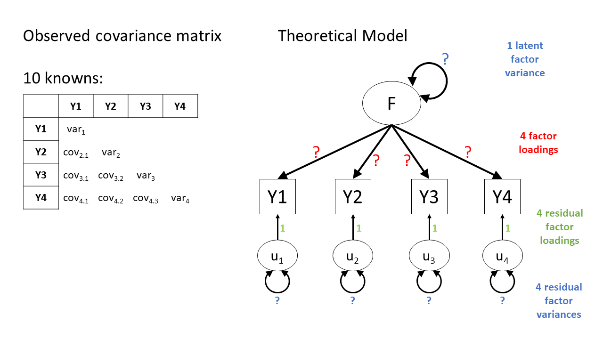
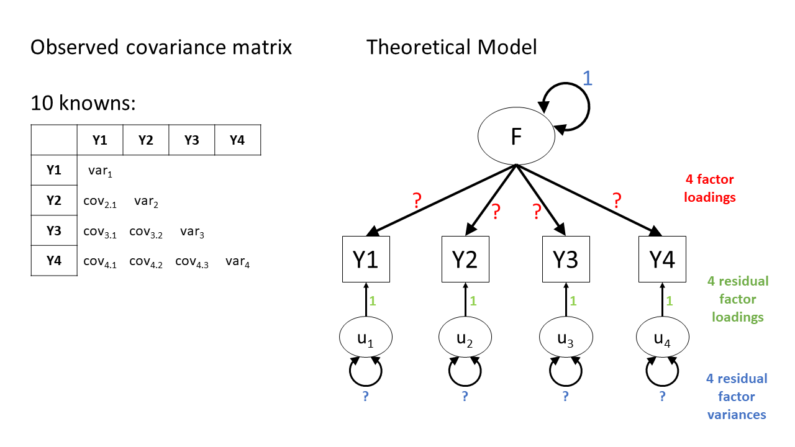

```{r}
#| label: setup
#| include: false
source('assets/setup.R')
library(xaringanExtra)
library(tidyverse)
library(patchwork)
library(ggdist)
xaringanExtra::use_panelset()
qcounter <- function(){
  if(!exists("qcounter_i")){
    qcounter_i <<- 1
  }else{
    qcounter_i <<- qcounter_i + 1
  }
  qcounter_i
}
# library(lavaan)
# sleepfocus = simulateData(
#   "F1 =~ .9*item1 + .7*item2 + -.6*item3
#    F2 =~ .8*item4 + -.7*item5 + .9*item6
#    F1 ~~ -.2*F2
#   ") |> apply(2,\(x) as.numeric(cut(x,7))) |>
#   as_tibble()
# names(sleepfocus) = paste0("q_",1:6)
# write_csv(sleepfocus, "../../data/lv_sleepfocus.csv")
sleepitems = c("I sleep well","I feel rested","I have trouble falling asleep","I can concentrate easily","I am easily distracted",  "I stay focused on tasks")

```

:::lo

- Learn about a method of testing theoretical models of the construct(s) tha result in variability in a set of observed variables
- First use of the __{lavaan}__ package in R


:::


# CFA

Confirmatory Factor Analysis (CFA) is a method that allows us to test a pre-specified factor structure (or to compare competing hypothesized structures). Typically these factor structures are ones that have been proposed based on theory or on previous research. Note that this is a change from the 'exploratory' nature of EFA to a situation in which we are explicitly imposing a theoretical model on the data.  

The diagram for a Confirmatory Factor Analysis model looks very similar to that of an Exploratory Factor Analysis, but we now have the explicit **absence** of some arrows - i.e. a variable loads on to a specific factor (or factor*s* - we can have a variable that loads on multiple), and **not** on others.  

The absence of some arrows is what imposes our theory here - the diagram in @fig-cfa makes the claim that the *only* reason we would see a correlation between items `y1` and `y6` is because the underlying factors are correlated. 

```{r}
#| echo: false
#| out-width: "100%"
#| label: fig-cfa
#| fig-cap: "CFA as a diagram"
knitr::include_graphics("images/diag_cfa.png")
```

# CFA in R - The lavaan package

For these sort of models, we're going to rely heavily on the **lavaan** (**La**tent **Va**riable **An**alysis) package. 
This is the main package in R for fitting a whole wealth of model types - all of which come under the umbrella term of "Structural Equation Models (SEM)", and there is a huge scope of what we can do with it.  

__Operators in lavaan__  
  
The first thing to get to grips with is the various new operators which __lavaan__ allows us to use.   

Our standard multiple regression formula in R was specified as 

```
y ~ x1 + x2 + x3 + ...
```

In lavaan, we continue to fit regressions using the `~` symbol, but we can also specify the construction of latent variables using `=~` and residual variances & covariances using `~~`.  

|  Formula type|  Operator|  Mnemonic|
|--:|--:|--:|
|  latent variable definition|  `=~`|  "is measured by"|
|  regression|  `~`|  "is regressed on"|
|  (residual) (co)variance |  `~~`|  "is correlated with"|
|  intercept |  `~1`|  "has an intercept"|
|  defined parameters | `:=` | "is defined as" |

(from https://lavaan.ugent.be/tutorial/syntax1.html) 

:::rtip
__Fitting models with lavaan__

In practice, fitting models in __lavaan__ tends to be a little different from things like `lm()` and `(g)lmer()`. Instead of including the model formula *inside* the fit function (e.g., `lm(y ~ x1 + x2, data = df)`), we tend to do it in a step-by-step process. This is because as our models become more complex, our formulas can get pretty long!   

In __lavaan__, it is typical to write the model as a character string (e.g. `mymodel <- "y ~ x1 + x2"`) and then we pass that formula along with the data to the relevant __lavaan__ function such as `cfa()` or `sem()`, giving it the formula and the data: `cfa(mymodel, data = mydata)`.  

So if we are fitting a model that --- in a diagram --- looks like this: 




1. First we specify the model. By default, the correlation between factors will be included, but it's good to specify it anyway
```{r}
library(lavaan)
mydata <- read_csv("https://uoepsy.github.io/data/lv_sleepfocus.csv")

mymodel <- "
  sleep =~ q_1 + q_2 + q_3
  focus =~ q_4 + q_5 + q_6
  sleep ~~ focus # included by default
"
```
2. Estimate the model (other fitting functions include `sem()`, `growth()` and `lavaan()`):
```{r}
myfittedmodel <- cfa(mymodel, data = mydata)
```
3. Examine the fitted model: 
```{r}
#| eval: false
summary(myfittedmodel)
```
The output of the `summary()` will show you each estimated parameter in your model (you can think of these as each of the lines in the diagram). It groups these according to whether they are loadings onto latent variables (the factors), covariances, regressions, variances etc.  

```
...
... info about estimation process
...
... info about model identification and fit
...
Parameter Estimates:

Latent Variables:
                   Estimate  Std.Err  z-value  P(>|z|)
  sleep =~                                            
    q_1               1.000                           
    q_2               0.838    0.145    5.777    0.000
    q_3              -0.846    0.146   -5.780    0.000
  focus =~                                            
    q_4               1.000                           
    q_5              -0.706    0.103   -6.891    0.000
    q_6               0.843    0.123    6.866    0.000

Covariances:
                   Estimate  Std.Err  z-value  P(>|z|)
  sleep ~~                                            
    focus            -0.157    0.052   -3.011    0.003

Variances:
                   Estimate  Std.Err  z-value  P(>|z|)
   .q_1               0.834    0.107    7.772    0.000
   .q_2               1.045    0.094   11.132    0.000
   .q_3               1.111    0.098   11.362    0.000
   .q_4               1.100    0.131    8.400    0.000
   .q_5               0.985    0.084   11.738    0.000
   .q_6               1.031    0.103   10.042    0.000
    sleep             0.549    0.117    4.707    0.000
    focus             0.792    0.148    5.365    0.000

```

:::


# "Model Fit" 

You'll have probably heard the term "model fit" many times when learning about statistics. However, the exact meaning of the phrase is different for different modelling frameworks.

We can think more generally as "model fit" as asking "how well does our model reproduce the characteristics of the data that we observed?". In things like multiple regression, this has been tied to the question of "how much variance can we explain in outcome $y$ with our set of predictors?"^[or in logistic regression, "what is the likelihood of observing the outcome $y$ given our model parameters?"].  

For methods like CFA, we are working with models that are fitted to the *covariances matrix* rather than to an outcome variable, so "model fit" becomes "how well can our model reproduce our observed covariance matrix?".   

::: {.callout-caution collapse="true"}
#### optional: how does a model reproduce a covariance matrix?

After so much time working in a regression world, where we can think of each value on the outcome variable being predicted by some combination of the predictor variables, it can be a bit odd to think about how models like CFA and SEM predict the values in a covariance matrix. The missing link is probably easiest described by showing what different theoretical models *imply* for a covariance matrix.  

For instance, in @fig-pt1, we can see a (rather odd) theoretical model of four variables. Each variable has some variance (the looped arrows back on themselves), but the lack of arrows between them indicates that we would *expect* to see covariances of 0 between them all. If we then collect data on those four variables, and fit the model to that data, it will estimate the parameters in the model ($u_{y1}$ to $u_{y4}$) based on an optimisation method such as maximum likelihood estimation. These parameters therefore imply a covariance matrix, and we can compare this to the actual covariance matrix we observe between the variables.  
```{r}
#| echo: false
#| label: fig-pt1
#| fig-cap: "A theoretical model that four variables are uncorrelated"

```

We could have another theoretical model of how the four variables are related. For instance, we could just say "they're all related to each other for whatever reason!". This would be essentially like connecting each pair of variables by a double-headed arrow (indicating covariance), as in @fig-pt2.  

This model means we estimate all those covariances between each pair of variables, and so we can *perfectly* reproduce any observed covariance matrix, but we're not gaining anything. 
We started with 10 things in the covariance matrix, and the model has to estimate 10 things (letters $a$ to $f$ and $u_{y1}$ to $u_{y4}$ in @fig-pt2). 

```{r}
#| echo: false
#| label: fig-pt2
#| fig-cap: "A theoretical model that four variables are all correlated with one another"

```

Another way in which we could theorise about relations between the four variables is to posit that they are only related **because** they are each representing (to different degrees) the same underlying "latent factor" (i.e., the same construct). This is shown in @fig-pt3, and only requires us to estimate 8 things, rather than 10. In doing so it also assumes the existence of some latent factor $F$.  


```{r}
#| echo: false
#| label: fig-pt3
#| fig-cap: "A theoretical model that four variables are related to one another *because* they are all manifest variables of some latent factor"
knitr::include_graphics("images/intropathtrace/Slide3.PNG")
```

The core idea here is that from the diagram on the left there is an algorithmic way to calculate an implied value for the entries in the covariance matrix on the right. So from a given diagram, we can work out what values we would expect to see in a covariance matrix, in terms of combinations of estimated paths in the diagram.  

Once the model gets fitted to some data and the paths are estimated, these paths give us an implied covariance matrix that we can evaluate against our observed one, therefore allowing us to talk about "model fit"  

```{r}
#| include: false
#| eval: false
library(lavaan)
library(semPlot)
set.seed(234)
dgp="L=~.7*Y1+.7*Y2+.8*Y3+.5*Y4
      Y1~~.4*Y1\nY2~~1.3*Y2
      Y3~~.5*Y3\nY4~~.9*Y4"
dat = simulateData(dgp)
mm = "Y1~~ey1*Y1\nY2~~ey2*Y2\nY3~~ey3*Y3\nY4~~ey4*Y4"
mod = sem(mm,dat)
semPaths(mod, whatLabels = "name")
mod@implied$cov
cov(dat)
semPaths(mod, whatLabels = "est")


mm = "Y1~~Y2
      Y1~~Y3
      Y1~~Y4
      Y2~~Y3
      Y2~~Y4
      Y3~~Y4"
mod = sem(mm,dat)
semPaths(mod, whatLabels = "name")
mod@implied$cov
cov(dat)
semPaths(mod, whatLabels = "est")

mm = "L=~Y1+Y2+Y3+Y4"
mod = sem(mm,dat,std.lv=T)
semPaths(mod, whatLabels = "name")
mod@implied$cov
cov(dat)
semPaths(mod, whatLabels = "est")
```

:::


| model fit in `lm()` | model fit in CFA/SEM |
| --------------------| ---------------------|
| "how well does our model reproduce the values in the outcome variable?" | "how well does our model reproduce the values in our covariance matrix?" |


## Degrees of Freedom

In regression, we could only talk about model fit if we had more than 2 datapoints. This is because there is only one possible line that we can fit between 2 datapoints, and this line explains _all_ of the variance in the outcome variable (it uses up all our 2 degrees of freedom to estimate the intercept and the slope).   

The logic is the same for model fit in terms of CFA and SEM - we need more observed things than we have parameters that our model is estimating. The difference is that "observed things" are the values in our covariance matrix, rather than individual observations. The idea is that we need to be estimating fewer parameters (fewer "paths" or lines in the diagram) than there are unique values (variances and covariances) in our covariance matrix. This is because if we just fit paths between all our variables, then our model would be able to reproduce the data perfectly (just like a regression with 2 datapoints has an $R^2$ of 1).  


The degrees of freedom for methods like CFA, Path Analysis and SEM, that are fitted to the covariance matrix of our data, correspond to the number of *knowns* (observed covariances/variances from our sample) minus the number of *unknowns* (parameters to be estimated by the model). 


:::sticky
**degrees of freedom = number of knowns - number of unknowns**  

  - number of knowns: how many unique variances/covariances in our data?  
  The number of knowns in a covariance matrix of $k$ observed variables is equal to $\frac{k \cdot (k+1)}{2}$.  
  - number of unknowns: how many parameters is our model estimating?  
  We can reduce the number of unknowns (thereby getting back a degree of freedom) by fixing parameters to be specific values. *By removing a path altogether, we are fixing it to be zero.*  

A model is only able to be estimated if it has at least 0 degrees of freedom (if there are as many knowns as unknowns). 


| degrees of freedom |-| what can/can't be done |
|--------------------|- |----------------------- |
| $>0$ degrees of freedom | **over-identified** | can estimate parameters and their standard errors, and can estimate model fit |
 | 0 degrees of freedom |**just-identified** | can estimate parameters and their standard errors, but not model fit |
| $<0$ degrees of freedom |**under-identified** | can estimate parameters but not their standard errors (so basically useless), and cannot estimate model fit   |


:::


## Model Fit Measures

There are _loads_ of different metrics that people use to examine model fit for CFA and SEM, and there's lots of debate over the various merits and disadvantages as well as the proposed cut-offs to be used with each method.  

The most fundamental test of model fit is a $\chi^2$ test, which reflects the discrepancy between our observed covariance matrix and the *model-implied* covariance matrix. If we denote the population covariance matrix as $\Sigma$ and the model-implied covariance matrix as $\Sigma(\Theta)$, then we can think of the null hypothesis here as $H_0: \Sigma - \Sigma(\Theta) = 0$. In this way our null hypothesis is that our theoretical model is correct (and can therefore perfectly reproduce the covariance matrix). This means that a significant result indicates _poor_ fit. It is very sensitive to departures from normality, as well as sample size (for models with $n>400$, the $\chi^2$ is almost always significant), and can often lead to rejecting otherwise adequate models.  

Alongside this, the main four fit indices that are commonly used are known as RMSEA, SRMR, CFI and TLI. Smaller values of RMSEA and SRMR mean better fit while larger values of CFI and TLI mean better fit.  

**Convention:** if $\textrm{RMSEA} < .05$, $\textrm{SRMR} < .05$, $\textrm{TLI} > .95$ and $\textrm{CFI} > .95$ then the model fits well.  

::: {.callout-caution collapse="true"}
#### optional: absolute fit indices

```{r}
#| echo: false
#| out-width: "100%"
knitr::include_graphics("images/fitmeas_abs.PNG")
```

:::
::: {.callout-caution collapse="true"}
#### optional: incremental fit indices

```{r}
#| echo: false
#| out-width: "100%"

```
:::

:::rtip
__Fit Indices in R__  

In R, we can ask for more fit measures in a number of ways:  

1. We can ask for them to be added to the `summary()` output by using `summary(myfittedmodel, fit.measures = TRUE)`. The output gets pretty long, so we won't print it here.  

2. We can use the `fitmeasures()` function, by just giving it our fitted model object: `fitmeasures(myfittedmodel)`. Even this gives us a lot of information - there are hundreds of different measures of "model fit" that people have developed, and it lists lots of them. Often, it is therefore easier to just index the specific ones we want:  
```{r}
fitmeasures(myfittedmodel)[c("srmr","rmsea","cfi","tli")]
```

:::

One initially slightly bizarre aspect of latent variable models is that they involve estimating parameters between variables **some of which we never observe**. This seems almost like magic - we ask people questions about how well they sleep, if they fidget or worry etc., and somehow we are able to then estimate parameters concerning some underlying latent variable that represents 'anxiety' (but that we could never even hope to measure). The existence of any such latent variable is extremely theory driven - we are making a strong claim that there **is** some underlying thing that is causing our observed variables to covary. In diagrams like @fig-cfa, we never observe the latent variables `F1` or `F2`, we simply theorise them into existence^[I think therefore I am?] as an explanation for what we _do_ observe.  

One important point is that models with latent variables that exhibit "good fit" do not prove the existence of any latent variable (such a task is impossible). In fact, it's entirely possible that there are other theoretical models that fit equally well but without positing the existence of latent variables. Conceptually, we should always be scrutinising the meaning of our latent variables in the context of what we know (or think) about the field in which we are working. 


# Latent Variable Scaling

If we are happy to commit to the latent variables in our model being _conceptually meaningful_, we still need to define these variables _numerically_.  

Think of a factor model as containing sets of regressions of $item1 = \lambda_1\cdot Factor + u_1$, but where we never observe the "Factor" variable. So how can we ever estimate this model? In order to estimate parameters of these models (parameters like $\lambda_1$ - the factor loadings), we must commit to fixing some numeric feature of our latent variable - we must somehow fix its scale.  

In @fig-df1, we can see a model of a latent factor loading on to 4 items. The number of paths in the model (all the arrows) is greater than the number of known values in our covariance matrix. However, we get around this by *fixing certain parameters to be specific values*. For instance, we fix the paths from the residuals to the items to be 1 residual factor loadings to be 1 (this is almost always done, and means that often the diagrams are drawn more simply with the residuals presented as curved arrows from the items instead, but it's the same model). While this makes our model over-identified (10 observed things, 9 things to estimate), there are infinitely many sets of numbers that would fit here because the latent factor has no numeric scale. We need to provide the number line on which we are going to score it.  

To get our heads around this, imagine a simple regression model `lm(shoe_size ~ height)`. The variable `height` could be measured in mm, cm, m, km, inches, feet, etc., and all would be exactly the same model, but each using a different set of numbers. The idea here is (conceptually) the same - we need to numerically define what 0-1 maps to for our latent variable.  

```{r}
#| echo: false
#| label: fig-df1
#| fig-cap: "A four item factor structure. Fixing the four residual factor loadings to be 1 makes the model identifiable (10 knowns, and 9 parameters to estimate), but the latent variable has no scale"

```

There are two ways to typically provide a latent variable with a scale. The first is to fix one of the factor loadings to be 1. This means the latent variable inherits the scale of that item (@fig-df2). The second approach fixes the variance of the latent variable to be 1 (@fig-df3).  

```{r}
#| echo: false
#| label: fig-df2
#| fig-cap: "A four item factor structure, fitted with the 'marker method'"

```
```{r}
#| echo: false
#| label: fig-df3
#| fig-cap: "A four item factor structure. With the latent variable variance fixed to 1 (i.e., standardised)"

```

:::sticky
__Scaling a latent variable__  

- "marker method": fix the first factor loading to 1. Useful if you have one specific item that is conceptually stronger than others and measured on a meaningful scale
- "unit variance": fix the variance of the latent variable to 1. Useful to evaluate factor loadings as these will represent standardised contribution of factor on each item.  

:::

:::rtip
__Latent Variable Scaling in R__  

In __lavaan__, using `cfa()` will default to using the "marker method" and fixing the first loading of each factor to equal 1.   

While the two models below are essentially the same, we can switch up _which_ specific item we want to have the loading fixed for, and just put that one first when defining the factor (e.g., note below that the order of items differs when defining the `sleep` factor).  

::::{.columns}
:::{.column width="48%"}
```{r}
#| eval: false
mymodel <- "
  sleep =~ q_1 + q_2 + q_3
  focus =~ q_4 + q_5 + q_6
  sleep ~~ focus # included by default
"
cfa(mymodel, data = mydata)
```

:::
:::{.column width="4%"}
:::
:::{.column width="48%"}
```{r}
#| eval: false
mymodel <- "
  sleep =~ q_3 + q_1 + q_2
  focus =~ q_4 + q_5 + q_6
  sleep ~~ focus # included by default
"
cfa(mymodel, data = mydata)
```
:::
::::

If instead we want to scale the latent variables by fixing their variances to be equal to 1, then we can use `std.lv = TRUE` when fitting the model:  

```{r}
myfittedmodel <- cfa(mymodel, data = mydata)
myfittedmodel_std <- cfa(mymodel, data = mydata, std.lv = TRUE)
```

There's a lot of parameter estimates in these sorts of models, so it looks like a lot differs between these models. But remember the models themselves are the same, we're just re-scaling the latent variable, and so re-scaling the estimates.  

In the two sets of loadings below, there is a link --- the ratios are the same! If we take the set on the right hand side, but re-express them relative to the first one (the loading of 0.741), then we get back those loadings on the left hand side! $\frac{0.621}{0.741} = $`r round(0.621/0.741, 3)` and $\frac{-0.627}{0.741} = $`r round(-0.627/0.741, 3)`.  

There is one key difference here - the hypothesis testing stuff (the `Std.Err`, `z-value` and `P(>|z|)` columns) will be different because they are taking each estimate and testing against the null hypothesis that the estimate is zero.  

::::{.columns}
:::{.column width="48%"}
__first loading = 1__  

```
Latent Variables:
            Estimate  Std.Err  z-value  P(>|z|)
  sleep =~  
    q_1     1.000                           
    q_2     0.838     0.145    5.777    0.000
    q_3    -0.846     0.146   -5.780    0.000
```
:::
:::{.column width="4%"}
:::
:::{.column width="48%"}
__latent variable variance = 1__  

```
Latent Variables:
            Estimate  Std.Err  z-value  P(>|z|)
  sleep =~                                            
    q_1     0.741     0.079    9.415    0.000
    q_2     0.621     0.073    8.485    0.000
    q_3    -0.627     0.075   -8.403    0.000
```
:::
::::

__Post-hoc standardisation__  

We can also quickly get out standardised estimates (or 'standardized' if you're a north american speaker!) by simply asking for them in the `summary()`. This will output extra columns next to the parameter estimates.  

- The `std.lv` column shows the estimates if the latent variables have a variance equal to 1 ("std.lv" = "standardised latent variables").  
- The `std.all` column shows us the estimates if the latent variables a variance equal to 1 **and** the observed variables have variances equal to 1 ("std.all" = "all things standardised").   

```{r}
#| eval: false
summary(myfittedmodel, standardized = TRUE)
```
```
Latent Variables:
            Estimate  Std.Err  z-value  P(>|z|)  Std.lv  Std.all
  sleep =~    
    q_1     1.000                                0.741    0.630
    q_2     0.838     0.145    5.777    0.000    0.621    0.519
    q_3    -0.846     0.146   -5.780    0.000   -0.627   -0.511
```


:::


# Making diagrams

For more complex models with latent variables, we will almost always have to make diagrams manually, either in generic presentation software such as powerpoint or google slides, or in specific software such as [semdiag](https://semdiag.psychstat.org/){target="_blank"}.  

R has a couple of packages which work well enough for some of the more common model structures such as CFA.  

The `semPaths()` function from __semPlot__ package can take a fitted lavaan model and create a nice diagram. 
```{r}
#| eval: false
library(semPlot)
semPaths(myfittedmodel, 
        what = ?, # line thickness & color by... 
        whatLabels = ?, # label lines as... 
        rotation = ? # rotations, +1 = 90degrees
        )
```


::: {.callout-tip collapse="true"}
#### optional: handy functionality! 

Occasionally we might want to draw models before we even get the data. __lavaan__ has some useful functionality where you can give it a model formula and ask it to "lavaanify" it into a model object that just hasn't yet been fitted to anything. 

For instance, by setting up a pretend model and "lavaanify-ing" it, we can then make a diagram!  
```{r}
library(lavaan)
library(semPlot)
pretend_model <- "
biscuits =~ digestive + oreo + custard_cream + bourbon + crackers
crisps =~ salt_vinegar + cheese_onion + prawn_cocktail + crackers
"
lavaanify(pretend_model) |>
  semPaths()
```

:::

# Model modifications  

:::imp
__Confirmatory? Exploratory? "Explirmatory"? "Confloratory"?__  


:::

TODO


When a factor structure does not fit well, we can either start over and go back to doing EFA, deciding on an appropriate factor structure, on whether we should drop certain items, etc. The downside of this is that we essentially result in _another_ version of the scale, and before we know it, we have 10 versions of the same measure floating around, in a perpetual state of scale-development. 
Alternatively, we can see if it is possible to minimally adjust our model based on areas of local misfit in order to see if our global fit improves. Note that this would still be in a sense _exploratory,_ and we should be very clear when writing up about the process that we undertook. We should also avoid just shoving any parameter in that might make it fit better - we should let common sense and theoretical knowledge support any adjustments we make.  

The `modindices()` function takes a fitted model object from __lavaan__ and provides a table of all the possible additional parameters we _could_ estimate.  

The output is a table, which we can ask to be sorted according to the `mi` column using `sort = TRUE`.  

```{r}
#| eval: false
modindices(myfittedmodel, sort = TRUE)
```
```
      lhs op    rhs     mi    epc sepc.lv sepc.all sepc.nox
72  item6 ~~ item10 10.747  0.082   0.082    0.144    0.144
25 fact1  =~  item7  8.106  0.119   0.080    0.080    0.080
65  item5 ~~  item7  6.720  0.039   0.039    0.160    0.160
71  item6 ~~  item9  6.675 -0.065  -0.065   -0.115   -0.115
.   ...   .   ...    ...    ...     ...      ...      ...
```

The columns show:  

- `lhs`,`op`,`rhs` : these three columns show the specific parameter, in lavaan syntax. So `fact1 =~ item7` is for the possible inclusion of `item7` being loaded on to the latent variable `fact1`. `item6 ~~ item10` is for the inclusion of a covariance between `item6` and `item10`, and so on.  
- `mi` : "modification index" = the change in the model $\chi^2$ value _were we to include this parameter in the model_  
- `epc` : "expected parameter change" = the estimated value that the parameter _would take were it included in the model_  
- `sepc.lv`, `sepc.all`, `sepc.nox` : these provide the `epc` values but scaled to when a) the latent variables are standardised, b) all variables are standardised, and c) all except exogenous observed variables are standardised (not relevant for CFA)  


Often, the `sepc.all`is a useful column to look at, because it shows the proposed parameter estimate in a standardised metric. i.e. if the `op` is `~~`, then the `sepc.all` value is a correlation, and so we can consider anything <.2/.3ish to be quite small. If `op` is `=~`, then the `sepc.all` value is a standardised factor loading, so values >.3 or >.4 are worth thinking about, and so on. 


::: {.callout-warning collapse="false"}
#### model modifications are exploratory!!

We could simply keep adding suggested parameters to our model and we will eventually end up with a perfectly fitting model.  

It's very important to think critically here about _why_ such modifications may be necessary. 

- The initial model may have failed to capture the complexity of the underlying relationships among variables. For instance, suggested residual covariances, representing unexplained covariation among observed variables, may indicate misspecification in the initial model. 
- The structure of the construct is genuinely different in your population from the initial one in which the scale is developed (this could be a research question in and of itself - i.e. does the structure of "anxiety" differ as people age, or differ between cultures?)

Modifications to a CFA model should be made judiciously, with careful consideration of theory as well as quantitative metrics. The goal is to develop a model that accurately represents the underlying structure of the data while maintaining theoretical coherence and generalizability.  

:::