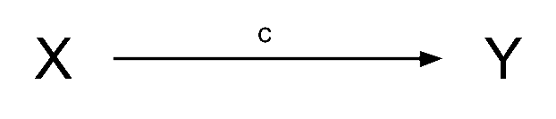
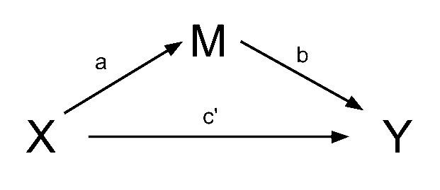

```{r}
#| label: setup
#| include: false
source('assets/setup.R')
library(xaringanExtra)
library(tidyverse)
library(patchwork)
library(ggdist)
xaringanExtra::use_panelset()
qcounter <- function(){
  if(!exists("qcounter_i")){
    qcounter_i <<- 1
  }else{
    qcounter_i <<- qcounter_i + 1
  }
  qcounter_i
}
library(lme4)
```

:::lo


:::


# brief overview  


::: {.callout-note collapse="true"}
#### Direct, Indirect and Total effects

In path diagrams:

- Direct effect = one single-headed arrow between the two variables concerned  
- Indirect effect = An effect transmitted via some other variables   

If we have a variable $X$ that we take to 'cause' variable $Y$, then our path diagram will look like @fig-total, which path $c$ is the __total effect__. This is the _unmediated_ effect of $X$ on $Y$.  
```{r}
#| echo: false
#| label: fig-total
#| fig-cap: "The total effect of X on Y"

```

However, the effect of $X$ on $Y$ could in part be explained by the process of being mediated by some variable $M$ as well as affecting $Y$ directly. A path diagram representing this theoretical idea of 'mediation' is shown in @fig-indirect. In this case, path $c'$ is the __direct effect__, and paths $a$ and $b$ make up the __indirect effect__.  

```{r echo=FALSE}
#| echo: false
#| label: fig-indirect
#| fig-cap: "The effect of X on Y is partly mediated by M"

```


You will find in some areas people talk about the ideas of __"complete"__ vs __"partial"__ mediation.

- __Complete mediation__ is when $X$ does not influence $Y$ other than its influence through $M$ (therefore path $c'$ would not be significantly different from zero). 
- __Partial mediation__ is when the path from $X$ to $Y$ is _reduced in magnitude_ when the mediator $M$ is introduced, _but still different from zero._  
- The __Proportion Mediated__ is the amount of the total effect of $X$ to $Y$ that goes via $M$. i.e. $\frac{a \times b}{c}$ in the images above. 

:::


## mediation in lavaan


::: {.callout-note collapse="true"}
#### Defined Parameters in lavaan

To specifically test the indirect effect, we need to explicitly **define** the indirect effect in our model, by first creating a label for each of its sub-component paths, and then defining the indirect effect itself as the product of these two paths.   

To do this, we use a new operator, `:=`. 

_"This operator 'defines' new parameters which take on values that are an arbitrary function of the original model parameters. The function, however, must be specified in terms of the parameter labels that are explicitly mentioned in the model syntax."_ ^[[the lavaan project](https://lavaan.ugent.be/){target="_blank"}].  
The labels are entirely up to us, we can use "a", "b" and "c", or "dougal", "dylan" and "ermintrude", they're just labels!  

```{r}
#| eval: false
med_model <- " 
    Y ~ b*M + c*X
    M ~ a*X
    
    indirect := a*b
    total := a*b + c
"
```

:::


::: {.callout-note collapse="true"}
#### Why Bootstrap?  

We are computing our indirect effect as the _product_ of the sub-component paths. However, this results in the estimated indirect effect rarely following a normal distribution, and makes our usual analytically derived standard errors & p-values inappropriate.   

Instead, bootstrapping has become the norm for assessing sampling distributions of indirect effects in mediation models (remember, bootstrapping involves resampling the data with replacement, thousands of times, in order to empirically generate a sampling distribution).  

We can do this easily in lavaan:

```{r}
#| eval: false
mod.est <- sem(model_formula, data=my_data, se = "bootstrap") 
# to print out the confidence intervals:
summary(mod.est, ci = TRUE)
```

:::


::: {.callout-caution collapse="true"}
#### optional: Y increases by `r res2[1]` when what? 

Typically people go no further in their interpretation of this coefficient than "The effect of X on Y through M". 

If you want to make this more explicit, the indirect effect estimate is the amount by which the outcome Y changes when the predictor X is held constant, and the mediator M changes by however much it _would have changed_ had the predictor increased by one.  

We can see this a bit clearer if we write down the prediction equations for Skill and Salary, and then see how it changes when we move from Education = 0 to Education = 1.  

| Educ | Skill | Salary |
| ---- | ------  | ------ |
|      | $= (a \times Educ)$  | $= (c' \times Educ) + (b \times Skill)$  |
| 0    | $= (0.166 \times Educ)$<br>$= (0.166 \times 0)$<br>$= 0$  | $= (0.482 \times Educ) + (3.568 \times Skill)$<br>$= (0.482 \times 0) + (3.568 \times 0)$<br>$= 0$ |
| 1    | $= (0.166 \times Educ)$<br>$= (0.166 \times 1)$<br>$= 0.166$ | $= (0.482 \times Educ) + (3.568 \times Skill)$<br>$= (0.482 \times 1) + (3.568 \times 0.166)$<br>$= (0.482) + (0.59)$ |

:::


::: {.callout-caution collapse="true"}
## optional: mediation using separate models

Following [Baron & Kenny 1986](http://citeseerx.ist.psu.edu/viewdoc/download?doi=10.1.1.917.2326&rep=rep1&type=pdf), we can conduct mediation analysis in a simpler way by using three separate regression models.  

1. $y \sim x$
2. $m \sim x$
3. $y \sim x + m$

Step 1. Assess the total effect of the predictor on the outcome `y ~ x`. This step establishes that there *is* an effect that may be mediated.    
```{r}
mod1 <- lm(Salary ~ Educ, data = edskill)
summary(mod1)$coefficients
```

Step 2. Estimate the effect of the predictor on the mediator `m ~ x`:
```{r}
mod2 <- lm(Skill ~ Educ, data = edskill)
summary(mod2)$coefficients
```

Step 3. Estimate the effects of the predictor and mediator on the outcome `y ~ x + m`. We need to show that the mediator affects the outcome variable. 
```{r}
mod3 <- lm(Salary ~ Educ + Skill, data = edskill)
summary(mod3)$coefficients
```

Step 4. If Steps 1-3 all show effects of `y~x`, `m~x` and `y~m|x`^[read `y~m|x` as `y~m` controlling for `x`] respectively, then we can assess mediation. We need to look at the how effect of the predictor on the outcome changes when we control for the mediator. This is from the same third model above. If the effect of the predictor is reduced, then we have mediation. If it is now zero, then we have complete mediation.  

This method is generally less optimal than using path models. Following the "separate models" approach^[sometimes referred to as "steps approach"] and requiring certain effects to be significant can sometimes lead to erroneous conclusions. For example, if `Y ~ 2*M + -2*X` and `M ~ 1*X`, then the total effect of `Y~X` would be $(2 \times 1) + -2 = 0$, leading us to say that there is no effect that could be mediated! In part the problems with this approach are because it doesn't actually *estimate* the indirect effects, and attempts to determine "is there mediation [Yes]/[No]?" based on the significance of the individual paths. Even if the total effect $c$ is significantly different from zero and the direct effect $c'$ is not, this does not imply that the coefficients $c$ and $c'$ are different from one another! We therefore need to conduct an extra step (a popular approach is the "Sobel's test") in order to asses whether $c-c'=0$, or to estimate the $ab$ path via bootstrapping like we do in __lavaan__.  

Perhaps a more relevant issue is that the separate models approach cannot so easily be generalised to situations with multiple mediators, multiple outcomes, or multiple predictors, whereas a path analytic approach can. In addition, both are susceptible to the same concerns of measurement reliability, confounding, predictor-mediator interactions, and the causal directions between variables.   

<!-- ::: {.callout-caution collapse="true"} -->
<!-- #### Optional - packages for estimating mediation effects -->

<!-- The __mediation__ package is a very nice approach that allows us to conduct mediation this way, and it also extends to allow us to have categorical variables (we can use a logistic regression as one of our models), or to have multilevel data (our models can be fitted using __lme4__).   -->

<!-- ```{r} -->
<!-- library(mediation) -->
<!-- mymediation <- mediate(model.m = mod2,  -->
<!--                        model.y = mod3,  -->
<!--                        treat='religiosity',  -->
<!--                        mediator='hlc', -->
<!--                        boot=TRUE, sims=500) -->

<!-- summary(mymediation) -->
<!-- ``` -->

<!-- - ACME: Average Causal Mediation Effects (the indirect path $\mathbf{a \times b}$ in @fig-medpaths).   -->
<!-- - ADE: Average Direct Effects (the direct path $\mathbf{c'}$ in @fig-medpaths).   -->
<!-- - Total Effect: sum of the mediation (indirect) effect and the direct effect (this is $\mathbf{(a \times b) + c)}$ in @fig-medpaths).   -->

<!-- ```{r} -->
<!-- #| echo: false -->
<!-- #| label: fig-medpaths -->
<!-- #| fig-cap: "Mediation Model. The indirect effect is the product of paths a and b. c' is the direct effect of x on y." -->
<!--  -->
<!-- ``` -->

<!-- ::: -->


:::


