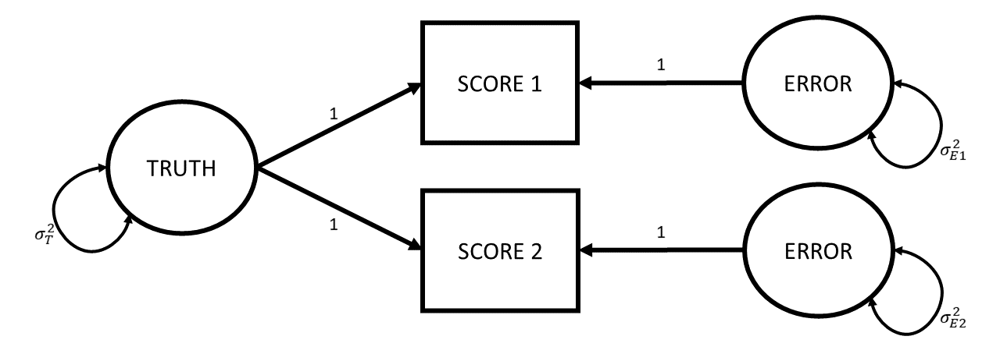

```{r}
#| label: setup
#| include: false
source('assets/setup.R')
library(xaringanExtra)
library(tidyverse)
library(patchwork)
library(ggdist)
xaringanExtra::use_panelset()
qcounter <- function(){
  if(!exists("qcounter_i")){
    qcounter_i <<- 1
  }else{
    qcounter_i <<- qcounter_i + 1
  }
  qcounter_i
}
library(lme4)
```

:::lo

- conceptual ideas about how we measure things


:::

Bad measurement is sometimes a bit like the rotten apple that spoils the entire barrel. 

A huge amount of research questions are focused on 'associations between' , 'effects on', 'differences in', 'change in' some construct or other. For any of these research studies to be successful we need to be able to actually *measure* that construct, and measure it well.  

Consider the idea that we might have some research question that is concerned with how some intervention might reduce "anxiety". While "anxiety" is quite an abstract concept, on the face of it, the idea that we all have different "levels of anxiety" feels okay. The problems come as soon as we attempt to quantify it. When we talk with friends we might tell them that we are feeling "a bit more anxious today", but our friends will probably never respond with "how much more? 3? or 4?".   

Because quantifying abstract psychological constructs is difficult, in part because these constructs are multifaceted. We want to be confident that when we ask person A about their anxiety, they are responding about the same thing as when we ask person B. One way to help feel more confident is to ask a bunch of questions. So we might end up with 5 questions that we ask them to indicate agreement/disagreement with (@fig-qitems), and then we're up and running!  

```{r}
#| label: fig-qitems
#| fig-cap: "5 questionnaire items that measure something. Maybe."
#| echo: false
knitr::include_graphics("images/qitems.png")
```

Very loosely, however, we can differentiate between two measurement related threats to research. The first we should think about is termed "construct validity" and essentially is concerned with whether people filling out the questionnaire in @fig-qitems is actually capturing anything about their levels of "anxiety". If you take a look at the wordings of the questions, you could argue that they are all statements about behaviours we consider to be a result of anxiety (i.e., avoidance behaviours, excessive worry, reassurance seeking, etc). But switch your perspective and consider how they could be seen as behaviours that represent healthy coping strategies (i.e., proactive stress management, social support utilization etc.). So what do these 5 questionnaire items measure? What does indicating "strongly agree" to all 5 items mean? More "anxiety"? Better "coping strategies"? Neither? Both?  

The second measurement related threat is the idea of the "consistency" or "reliability" of measurement. This is the concern that if a person fills out the questionnaire in @fig-qitems multiple times (assuming they have not changed in their underlying anxiety), then we would hope that their score is the same on both occasions.    


:::sticky

- **Validity:** whether our measurement instrument actually measures the thing we think it measures.    
- **Reliability:** how consistently our measurement instrument measures whatever it is measuring.  

:::

Within each of the threats of "validity" and "reliability", there are various of different forms. We will go through a selection of these and how we might try and assess them. It is worth keeping in mind these two broad definitions above, which will underpin everything we discuss here.  

# construct validity

Validity is types
how to assess

## face validity

:::sticky
Face validity: The extent to which a test appears, on the surface, to measure what it claims to measure. For example, a maths test that contains only arithmetic problems has good face validity.
:::

## convergent & discriminant validity

:::sticky
Convergent validity - The degree to which scores on a test are related to scores on other measures of the same construct. For instance, a new depression inventory correlating strongly with the Beck Depression Inventory.
Discriminant validity - The extent to which a test does not correlate strongly with measures of unrelated constructs. For example, a depression test showing weak correlation with an anxiety test.
:::

## predictive/criterion validity

:::sticky
Criterion validity - The extent to which test scores are related to an external criterion. For example, aptitude test scores predicting job performance.
:::


# reliability

> love truth but pardon error (Voltaire)

The very high level idea of reliability can be captured by the various words we could use instead of 'reliability'. We are talking about how reliable/consistent/repeatable/precise/stable/dependable/\<insert-synonym-here\> a measurement is. However, we need a more specific, mathematical definition of "reliability" in order to be able to try and quantify it for a given measurement instrument.  

The easiest way to get into thinking about reliability is probably to think about *repeated assessment*, as we have already hinted at earlier. If we measure person $i$ using instrument $X$ and then we measure person $i$ using instrument $X$ a second time (and we assume they haven't changed on the underlying construct), then a perfectly reliable measure would give us the exact same scores.  

For example, a reliable method of weighing a dog is to use the big specialised scales for pets that they have at the vets. A less reliable way is to awkwardly carry your dog onto your cheap bathroom scales and subtract your weight. Even less reliable would be to go and do this outside on a bumpy surface like gravel, where the scales don't work well, and deciding to do it standing on one leg...  

So one initial way to think about reliability in mathematical terms is to suppose that we do the measurement twice on the same units and see how well their scores correlate. 

::::{.columns}
:::{.column width="50%"}
```{r}
#| echo: false
set.seed(3)
df = tibble(
  true = rnorm(30,18,8),
  measurement_1 = rnorm(30,true,.3),
  measurement_2 = rnorm(30,true,.3)
) 
df[17,] <- as.data.frame(cbind(23.814346,23.6,23.9))

ggplot(df,aes(x=measurement_1, y = measurement_2))+
  geom_point(size=2,alpha=.4)+
  geom_segment(aes(x=true,xend=measurement_1,y=true,yend=measurement_2),col="red")+
  annotate(geom="segment",x=20,y=25,xend=23.5,yend=23.9)+
  annotate(geom="text",x=20,y=25,label="This is Dougal.\n he actually weighs 23.814346... kg\nthe first time I weigh him I get 23.6\nthe second time I get 23.9",hjust=1,size=5)+
  labs(title=paste0("cor(measure1, measurement2) = ", round(cor(df[,2],df[,3]),3)))
```

:::
:::{.column width="50%"}
```{r}
#| echo: false
set.seed(998)
df1 = tibble(
  true = df$true,
  measurement_1 = rnorm(30,true,2),
  measurement_2 = rnorm(30,true,2)
)
ggplot(df1,aes(x=measurement_1, y = measurement_2))+
  geom_point(size=2,alpha=.4)+
  geom_segment(aes(x=true,xend=measurement_1,y=true,yend=measurement_2),col="red")+
  annotate(geom="segment",x=18,y=27,xend=20.7,yend=25.9)+
  annotate(geom="text",x=18,y=28,label="This is Dougal.\nhe actually weighs 23.814346... kg\nthe first time I weigh him I get 20.6\nthe second time I get 25.9",hjust=1,size=5)+
  labs(title=paste0("cor(measure1, measurement2) = ",round(cor(df1[,2],df1[,3]),3)))
```
:::
::::

This is great as a way to start thinking about reliability, but it is hard to think about in situations where we *haven't* measured the same units twice. A more generalisable way to conceive of reliability can be got at by thinking about measurement in a diagrammatic way. Which is great, because I love diagrams!

So let's go back to basics. Whenever we measure something, we get a number^[(hooray, I love numbers almost as much as I love diagrams!]. But there are almost always two things that make that number what it is: there is the "true" value of the construct that we're measuring, and then there is error. This error might come from different things - it could be rounding error (our scales only display to the 10th of a kg), it could be random error due to a poor instrument (e.g., using our bathroom scales on some bumpy cobbles that happen to make it weigh higher/lower depending on where we position the scales), or it could be other stray causes that are unrelated to the construct we're trying to measure (e.g., measurements of anxiety often include a question about sleep habits, but there are lots of other things that influence sleep!).  

Drawing our diagram then, when we measure something, we observe one thing (the score), but this is caused by two unobserved things (the truth and some error). Following the conventions for drawing these sorts of diagram, things we observe are in squares, and unobservables are in circles.  

```{r}
#| label: fig-ctt1
#| fig-cap: "When taking a measurement, the number (or 'score') that we get out is always one bit of truth, and one bit of error"
#| echo: false
#| fig-width: 12
knitr::include_graphics("images/ctt/Slide1.PNG")
```

One way to make the idea of "truth" here a little more concrete, let's suppose that I took my shoddy bathroom scales and weighed Dougal over and over and over and over again (ad infinitum). The numbers I get out will follow a normal distribution, the center of which we can think of as Dougal's "true" weight (assuming the scales aren't systematically biased). We often see weights a little higher, often a little lower, less often do we see things a lot higher or lower, etc. So "Truth" here refers to the idea of the 'long run' measurement.  

```{r}
#| echo: false
#| column: margin
plot(density(rnorm(1e4,mean=23.814346,sd=2)),main="10,000 measurements of Dougal's weight",xlab="observed weight")
```

Now let's expand from thinking about Dougal specifically to thinking about our proposed measurement process for weighing dogs in general. We have our "instrument" for measuring a dog's weights (our bathroom scales), and we can imagine all the measurements we might use this instrument for. For any dog we might use these scales to weigh, the observed number we see on the scales is going to be driven by 1) that dog's *true* weight, and 2) a little bit of error.  
Just like all the true weights of all dogs have a variance (some are big dogs that weigh a lot, some a little dogs that weigh less etc.), the errors that contribute to our measurements also have a variance (some readings will be a bit higher than truth, some will be a bit lower).   

If we add these variances to our diagram, we simply add curved lines to our "Truth" and "Error" variables: 
```{r}
#| label: fig-ctt2
#| echo: false
#| fig-width: 12
knitr::include_graphics("images/ctt/Slide2.PNG")
```

The really useful thing about diagrams like these is that they represent theoretical models that can be used to *imply* what we would expect to see in our observed variables (we saw this idea in CFA). One crucial thing that this specific model of measurement implies is that the variance we would see in our observed scores is going to be the variance in the true scores plus the variance in the errors.    

$$
Var(\text{Observed Scores}) = Var(\text{True Scores}) + Var(\text{Errors})
$$

As it turns out, we can actually find an intuitive way of thinking about this equation Let's take it to the extreme: If my measurement instrument is incredibly good in weighing dogs, then the variance in the errors is much much smaller (i.e., all measurements are within 0.1kg of the true score). If my measurement instrument is incredibly bad at weighing dogs, then the variance in errors is much bigger (sometimes when I weigh a dog that is 'in truth' 23.814346....kg, I will get a score of 15kg, sometimes I will get a score of 28kg etc).  

So a really generalisable way of thinking about reliability of measurement is to view it as "how much of the variance in our observed scores is due to true variance?".  

$$
\begin{align}
\text{reliability} &= \frac{Var(\text{true scores})}{Var(\text{observed scores})} \\
& \quad \\
&= \frac{Var(\text{true scores})}{Var(\text{true scores}) + Var(\text{errors})} 
\end{align}
$$

::: {.callout-note collapse="true"}
#### why not just "how much error variance is there?"  

We can't simply use the variance of measurement error on its own to quantify 'reliability' here, because what counts as "small" or "large" amounts of error depends entirely on the quantity we are measuring.  

For example, consider the following three scenarios: 

1. I am measuring the weight of dogs, and my scales are a bit off each time - there is a little bit of error. The errors have a variance of 1kg  
2. I am measuring the weight of dogs, and my scales are *wayy* off each time - there is a massive amount of error. The errors have a variance of 100kg  
3. I am measuring the weight of elephants, and my scales are a little bit off each time - there is a little bit of error. The errors have a variance of 100kg  

The size of the error variance (1kg or 100kg) by itself doesn't determine how much "off" (a little bit off vs waayy off) we consider the measurements to be. What is important is how big this error variance is **relative to** the true variance of the things being measured.  

Elephants' weights vary between TODO and TODO, so mis-measuring by 100kg isn't really that bad in the grand scheme of things. But dogs' weights vary between c5kg and 50kg, so mis-measuring by 100kg is ridiculous. 

:::

::: {.callout-caution collapse="true"}
#### Optional: other implied assumptions of this model of measurement

These diagrams are a great way to also see the assumptions that are underpinning our theories.  

There are two further implications by thinking of our measurements as it is drawn in @fig-ctta.  

```{r}
#| label: fig-ctta
#| echo: false
#| fig-width: 12
knitr::include_graphics("images/ctt/Slide2.PNG")
```

1. Errors are not correlated with the truth.   
In the diagram, this is represented by the fact that there is no arrow between the Truth and Error variables. 
What this means in an applied setting is that we assume that the amount of measurement error isn't less/more for someone who has a low true value than it is for someone with a high one. Continuing with the act of weighing dogs, this is the assumption that if my scales are showing a value that is $\pm1kg$, then it is $\pm1kg$ for a dog that actually weighs 5kg and for one that actually weighs 50kg. You could imagine this not being the case if, e.g., the 50kg dog squashed the scales down so much that the scales always showed $50 \pm 0.1kg$, and the scales didn't work as well for the little 5kg dog where we see scores of $5 \pm 3kg$.  

```{r}
#| echo: false
set.seed(86)
df2 = tibble(
  true = df$true,
  e = 2-2*df$true/max(df$true),
  measurement_1 = rnorm(30,true,e),
  measurement_2 = rnorm(30,true,e)
)
ggplot(df2,aes(x=measurement_1, y = measurement_2))+
  geom_point(size=3,alpha=.4)+
  geom_segment(aes(x=true,xend=measurement_1,y=true,yend=measurement_2),col="red")
```

2. error has mean zero (no systematic bias)
TODO
```{r}
#| echo: false
set.seed(86)
df2 = tibble(
  true = df$true,
  measurement_1 = rnorm(30,true,2),
  measurement_2 = rnorm(30,true,2)
)
ggplot(df2,aes(x=measurement_1, y = measurement_2))+
  geom_point(size=3,alpha=.4)+
  geom_segment(aes(x=true,xend=measurement_1,y=true,yend=measurement_2),
               col="red")
```


:::

This way of thinking about reliability might seem nice and intuitive, but if we think about having to actually _quantify_ reliability this way, then we suddenly realise that we don't have enough information... We are essentially saying "observed score = unobserved truth + unobserved error". This is like being given a math problem of "23.5 = T + E, please solve" --- it's impossible!  

Things get a lot better when we have multiple scores.  
- diagram two scores

```{r}
#| label: fig-ctt3
#| echo: false
#| fig-width: 12

```

there are some implications of this diagram! : 
Firstly - true values haven't changed between the assessments  
secondly, the true value contributes the same to each assessment  
thirdly, there is the same amount of error at each assessment. i.e,. it's not the case that the 2nd assessment involves much bigger or smaller errors than the first. i.e., $\sigma^2_{E1} = \sigma^2_{E2}$ 
finally, the errors are uncorrelated - happening to have score 1 be a little bit above your true value tells us nothing about how off our score will be at time 2.  


::: {.callout-caution collapse="true"}
#### optional - where did the correlation between repeated measurements go?  

but somewhere along teh way we've lost the whole idea of "consistency across repeated assessment"? is that reliability? or is it about the ratio of true variance to score variance? 

it's both! 

now this diagram can be used to *imply* the covariance between the observed variables. according to this diagram, the only way that score 1 and score 2 covary is via the true values.  So cov(score_1, score_2) is just going to be $\sigma^2_T$.  

to turn a covariance into a correlation, we must divide it by the standard deviations of the two variables: i.e., $cor_{xy} = \frac{cov_{xy}}{sd_x \cdot sd_y}$. 
and we have talked about how the variance in scores = variance in true values plus variance in errors: $\sigma^2_T + \sigma^2_E$, so the standard deviation of a score 1 is $\sqrt{(\sigma^2_T + \sigma^2_{E1})}$. 

As it happens, when we do this, the equation simplifies to show that $cor_{s1s2} = \frac{\sigma^2_T}{\sigma^2_T + \sigma^2_E}$. i.e., the correlation between scores from repeated assessments is equal to that same concept of "proportion of true variance out of total variance (true variance + error variance)". so it's the same old reliability idea!  


optional:  

remember that $\sigma$ represents a standard deviation, and $\sigma^2$ a variance:  

$$
\begin{align}
cor_{s1s2} &= \frac{cov_{s1s2}}{\sigma_{s1} \cdot \sigma_{s2}} \\
\, \qquad \\
&= \frac{cov_{s1s2}}{\sqrt{\sigma^2_{s1}} \cdot \sqrt{\sigma^2_{s2}}} \\
\, \qquad \\
&= \frac{\sigma^2_T}{\sqrt{(\sigma^2_T + \sigma^2_E)} \cdot \sqrt{(\sigma_T^2 + \sigma^2_E)}}  \\
\, \qquad \\
& = \frac{\sigma^2_T}{\sigma^2_T + \sigma^2_E}
\end{align}
$$

:::

So where do these repeated assessments come from? There are lots of ways in which we can think of having "parallel tests" (i.e., having multiple instances of measurements of the same construct).  

we could: 

- take a measurement, wait a bit (how long?), and then take another measurement
- take a measurement with version-A of the measurement instrument and then take a measurement with version-B
- get two (or more) people to measure the same units
- administer a whole bunch of different measurement instruments 

for each of these situations there are calculations people use to quantify the reliability. they differ because of how they are partitioning variance in to "true variance" and "error variance".  


- repeated assessments
- alternate forms
- inter rater
- internal consistency (congeneric). link back to FA


## test-retest reliability

:::sticky
- Test-retest - Consistency of test scores when the same test is administered to the same group on two different occasions.
:::

## alternate forms reliability

:::sticky
- alternate forms - Consistency of scores between two equivalent versions of a test that measure the same construct.
:::

## inter-rater reliability

:::sticky
- Inter-rater - Degree of agreement or consistency between two or more raters/observers scoring the same behaviour or responses.
:::

## internal consistency 

:::sticky
- Internal consistency - Consistency of responses across items within the same test
:::
### coefficient alpha

scale scores assume tau equivalent


### mcdonald's omega

factor scores assume congeneric

# the impact of reliability

attenuation


# reliability is the ceiling for validity


