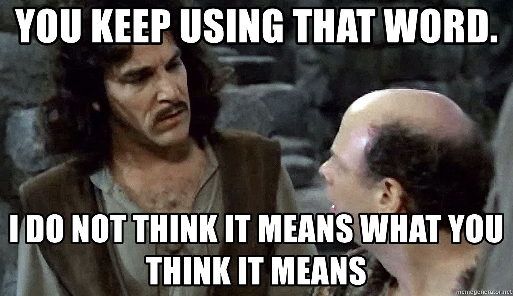
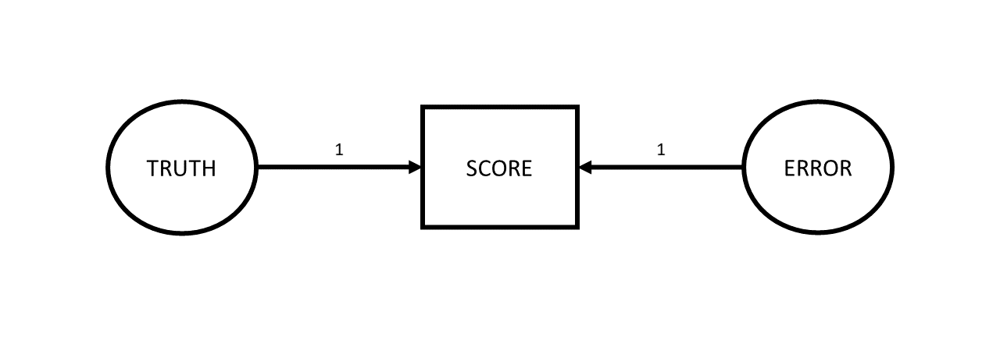

```{r}
#| label: setup
#| include: false
source('assets/setup.R')
library(xaringanExtra)
library(tidyverse)
library(patchwork)
library(ggdist)
xaringanExtra::use_panelset()
qcounter <- function(){
  if(!exists("qcounter_i")){
    qcounter_i <<- 1
  }else{
    qcounter_i <<- qcounter_i + 1
  }
  qcounter_i
}
library(lme4)
```

:::lo

- conceptual ideas about how we measure things



:::

Bad measurement is sometimes a bit like the rotten apple that spoils the entire barrel. 

A huge amount of research questions are focused on 'associations between' , 'effects on', 'differences in', 'change in' some construct or other. For any of these research studies to be successful we need to be able to actually *measure* that construct, and measure it well.  

Consider the idea that we might have some research question that is concerned with how some intervention might reduce "anxiety". While "anxiety" is quite an abstract concept, on the face of it, the idea that we all have different "levels of anxiety" feels okay. The problems come as soon as we attempt to quantify it. When we talk with friends we might tell them that we are feeling "a bit more anxious today", but our friends will probably never respond with "how much more? 3? or 4?".   

Because quantifying abstract psychological constructs is difficult, in part because these constructs are multifaceted. We want to be confident that when we ask person A about their anxiety, they are responding about the same thing as when we ask person B. One way to help feel more confident is to ask a bunch of questions. So we might end up with 5 questions that we ask them to indicate agreement/disagreement with (@fig-qitems), and then we're up and running!  

```{r}
#| label: fig-qitems
#| fig-cap: "5 questionnaire items that measure something. Maybe."
#| echo: false
knitr::include_graphics("images/qitems.png")
```

Very loosely, however, we can differentiate between two measurement related threats to research. The first we should think about is termed "construct validity" and essentially is concerned with whether people filling out the questionnaire in @fig-qitems is actually capturing anything about their levels of "anxiety". If you take a look at the wordings of the questions, you could argue that they are all statements about behaviours we consider to be a result of anxiety (i.e., avoidance behaviours, excessive worry, reassurance seeking, etc). But switch your perspective and consider how they could be seen as behaviours that represent healthy coping strategies (i.e., proactive stress management, social support utilization etc.). So what do these 5 questionnaire items measure? What does indicating "strongly agree" to all 5 items mean? More "anxiety"? Better "coping strategies"? Neither? Both?  

The second measurement related threat is the idea of the "consistency" or "reliability" of measurement. This is the concern that if a person fills out the questionnaire in @fig-qitems multiple times (assuming they have not changed in their underlying anxiety), then we would hope that their score is the same on both occasions.    


:::sticky

- **Validity:** whether our measurement instrument actually measures the thing we think it measures.    
- **Reliability:** how consistently our measurement instrument measures whatever it is measuring.  

:::

Within each of the threats of "validity" and "reliability", there are various of different forms. We will go through a selection of these and how we might try and assess them. It is worth keeping in mind these two broad definitions above, which will underpin everything we discuss here.  

# construct validity

Validity is types
how to assess

## face validity

:::sticky
Face validity: The extent to which a test appears, on the surface, to measure what it claims to measure. For example, a maths test that contains only arithmetic problems has good face validity.
:::

## convergent & discriminant validity

:::sticky
Convergent validity - The degree to which scores on a test are related to scores on other measures of the same construct. For instance, a new depression inventory correlating strongly with the Beck Depression Inventory.
Discriminant validity - The extent to which a test does not correlate strongly with measures of unrelated constructs. For example, a depression test showing weak correlation with an anxiety test.
:::

## predictive/criterion validity

:::sticky
Criterion validity - The extent to which test scores are related to an external criterion. For example, aptitude test scores predicting job performance.
:::


# reliability

The very high level idea of reliability can be captured by the various words we could use instead of 'reliability'. We are talking about how reliable/consistent/repeatable/precise/stable/dependable/\<insert-synonym-here\> a measurement is. However, we need a more specific, mathematical definition of "reliability" in order to be able to try and quantify it for a given measurement instrument.  

The easiest way to get into thinking about reliability is probably to think about *repeated assessment*, as we have already hinted at earlier. If we measure person $i$ using instrument $X$ and then we measure person $i$ using instrument $X$ a second time (and we assume they haven't changed on the underlying construct), then a perfectly reliable measure would give us the exact same scores.  

For example, a reliable method of weighing a dog is to use the big specialised scales for pets that they have at the vets. A less reliable way is to awkwardly carry your dog onto your cheap bathroom scales and subtract your weight. Even less reliable would be to go and do this outside on a bumpy surface like gravel, where the scales don't work well, and deciding to do it standing on one leg...  

So one initial way to think about reliability in mathematical terms is to suppose that we do the measurement twice on the same units and see how well their scores correlate. 

::::{.columns}
:::{.column width="50%"}
```{r}
#| echo: false
set.seed(3)
df = tibble(
  true = rnorm(30,18,8),
  measurement_1 = rnorm(30,true,.2),
  measurement_2 = rnorm(30,true,.2)
) 
df[17,] <- as.data.frame(cbind(23.80100,23.6,23.9))

ggplot(df,aes(x=measurement_1, y = measurement_2))+
  geom_point(size=3,alpha=.4)+
  annotate(geom="segment",x=20,y=25,xend=23.5,yend=23.9)+
  annotate(geom="text",x=20,y=25,label="This is Dougal.\n he actually weighs 23.814346... kg\nthe first time I weigh him I get 23.6\nthe second time I get 23.9",hjust=1,size=5)+
  labs(title=paste0("cor(measure1, measurement2) = ", round(cor(df[,2],df[,3]),3)))
```

:::
:::{.column width="50%"}
```{r}
#| echo: false
set.seed(998)
df1 = tibble(
  true = df$true,
  measurement_1 = rnorm(30,true,2),
  measurement_2 = rnorm(30,true,2)
)
ggplot(df1,aes(x=measurement_1, y = measurement_2))+
  geom_point(size=3,alpha=.4)+
  annotate(geom="segment",x=18,y=27,xend=20.7,yend=25.9)+
  annotate(geom="text",x=18,y=28,label="This is Dougal.\nhe actually weighs 23.814346... kg\nthe first time I weigh him I get 20.6\nthe second time I get 25.9",hjust=1,size=5)+
  labs(title=paste0("cor(measure1, measurement2) = ",round(cor(df1[,2],df1[,3]),3)))
```
:::
::::

This is great as a way to think about reliability, but it is hard to think about in situations where we *haven't* measured the same units twice. A more generalisable way to conceive of reliability can be got at by thinking about measurement in a diagrammatic way. Which is great, because I love diagrams!

So let's go back to basics. Whenever we measure something, we get a number^[(hooray, I love numbers almost as much as I love diagrams!]. But there are almost always two things that make that number what it is: there is the "true" value of the construct that we're measuring, and then there is error. This error might come from different things - it could be rounding error (our scales only display to the 10th of a kg), it could be random error due to a poor instrument (e.g., using our bathroom scales on some bumpy cobbles that happen to make it weigh higher/lower depending on where we position the scales), or it could be other stray causes that are unrelated to the construct we're trying to measure (e.g., measurements of anxiety often include a question about sleep habits, but there are lots of other things that influence sleep!).  

Drawing our diagram then, when we measure something, we observe one thing (the score), but this is caused by two unobserved things (the truth and some error).  
Following the conventions for drawing these sorts of diagram, things we observe are in squares, and unobservables are in circles.  

```{r}
#| label: fig-ctt1
#| fig-cap: "When taking a measurement, the number (or 'score') that we get out is always one bit of truth, and one bit of error"
#| echo: false

```


One way to make the idea of "truth" here a little more concrete, let's suppose that I took my shoddy bathroom scales and weighed Dougal over and over and over and over again (ad infinitum). The numbers I get out would probably follow this sort of distribution, the center of which we can think of as Dougal's "true" weight (assuming the scales aren't systematically biased)
```{r}
#| echo: false
plot(density(rnorm(1e4,mean=23.814346,sd=2)),main="10,000 measurements of Dougal's weight",xlab="observed weight")
```

So let's expand from thinking about Dougal specifically to thinking about the measurement process of weighing dogs.  


- take a measurement instrument X
- imagine all possible measurements
- the true values have a variance
- each observed score is a little bit above/below the corresponding true value. i.e., there is a little bit of error.
- all these error vary - they have a variance


- these diagrams are theoretical models that can be used to imply what we would expect to see in observed variables. 
e.g., this model implies that observed scores we get out should also have a variance, and it is var(score) = var(truth) + var(error)


- consider two different tools
  - measure weight dogs. var(error) = 1kg, var(error)=100kg
  - measure weight elephants. var(error)=100kg not as unreliable. 
  - what is importnat: the relative proportion of the variance that is due to true score variance
  
- reliability is var(truth)/var(total) = var(truth)/(var(truth) + var(error))

measurement assumptions in diagrams
- error not correlated with truth
- error has mean zero (no systematic bias)
- 


- this is all fine, but all we're saying is observed = unobserved + unobserved.  
e.g., "23.5 = X + Y, please solve". impossible

things get better when we have multiple scores
- diagram two scores


- optional - hold on - how does it make sense with cor(m1,m2)?  


where do the two scores come from? 
- repeated assessments
- alternate forms
- inter rater
- internal consistency (congeneric). link back to FA


## old

Now imagine that we have measured a whole load of people using th. In fact, let's take it further and think about all the possible measurements this 
I observe some scores:  

> love truth but pardon error (Voltaire)

now imagine that i have measured a whole load of people. 
I observe some scores:  

and those scores have a variance: var(scores).  
But why do people vary in these measurements? Why do some people have high scores and some have low scores?  
Partly, this is because some people are 'in truth' lower or higher on the construct that we're measuring. So the true values have a variance too.  
Partly though, scores might vary due to error. so someone might score higher not because they genuinely are higher "in truth", but just for some other reason (i.e., just randomness).  

So the scores we observe vary, but that's just because True values vary (let's call this variance $\sigma^2_T$) and the errors vary (we'll call this $\sigma^2_E$).  

So the variance in scores = variance in true values + variance in errors.  


```{r}
df2 = tibble(
  truth = rnorm(5e1,20,6),
  error = rnorm(5e1,0,1),
  score = round(truth + error,1),
) |> mutate(error = score - truth)

SS = apply(df2,2,var)
sum(SS[1:2])
SS[3]

```


This is now where we can consider how different measurement tools have different reliabilities. Let's suppose that the amount of error doesn't vary that much. For instance, we might be weighing dogs in kilograms, and the scales are occasionally off by 10 grams, less often off by 20 grams, and very rarely off by 30 grams or more. So sometimes they show numbers +0.01kg from the dog's true weight, other times they show numbers -0.01kg. Occasionally they show numbers $\pm$0.02kg from the true weight, and very rarely they show numbers $\pm$0.03kg.  

You could imagine the scenario as in the dataframe below. It's just that in reality we only ever observe the middle column:  

```{r}
tibble(
  true = df$true,
  score = round(rnorm(nrow(df), true, .01),3),
  error = score - true
) |> as.data.frame() |> print(digits=5)
```

In this situation, the variance in the errors (roughly $0.01^2 = 0.0001$) is _tiny_ _tiny_ _tiny_ compared to the how much true weights vary. 


worse / better measure would be one where the error varies very little relative to the truth - i.e., it is more reliable

so we can quantify reliability as the amount of true variance that contributes to score variance  
T/(T+E)


but somewhere along teh way we've lost the whole idea of "consistency across repeated assessment"? is that reliability? or is it about the ratio of true variance to score variance? 

it's both! 
let's draw a diagram where we measure twice. it looks something like this: 


there are a couple of assumptions in this diagram. 
Firstly - true values haven't changed between the assessments  
secondly, the true value contributes the same to each assessment  
thirdly, there is the same amount of error at each assessment. i.e,. it's not the case that the 2nd assessment involves much bigger or smaller errors than the first. i.e., $\sigma^2_{E1} = \sigma^2_{E2}$ 
finally, the errors are uncorrelated - happening to have score 1 be a little bit above your true value tells us nothing about how off our score will be at time 2.  


now this diagram can be used to *imply* the covariance between the observed variables. according to this diagram, the only way that score 1 and score 2 covary is via the true values.  So cov(score_1, score_2) is just going to be $\sigma^2_T$.  

to turn a covariance into a correlation, we must divide it by the standard deviations of the two variables: i.e., $cor_{xy} = \frac{cov_{xy}}{sd_x \cdot sd_y}$. 
and we have talked about how the variance in scores = variance in true values plus variance in errors: $\sigma^2_T + \sigma^2_E$, so the standard deviation of a score 1 is $\sqrt{(\sigma^2_T + \sigma^2_{E1})}$. 

As it happens, when we do this, the equation simplifies to show that $cor_{s1s2} = \frac{\sigma^2_T}{\sigma^2_T + \sigma^2_E}$. i.e., the correlation between scores from repeated assessments is equal to that same concept of "proportion of true variance out of total variance (true variance + error variance)". so it's the same old reliability idea!  


optional:  

remember that $\sigma$ represents a standard deviation, and $\sigma^2$ a variance:  

$$
\begin{align}
cor_{s1s2} &= \frac{cov_{s1s2}}{\sigma_{s1} \cdot \sigma_{s2}} \\
\, \qquad \\
&= \frac{cov_{s1s2}}{\sqrt{\sigma^2_{s1}} \cdot \sqrt{\sigma^2_{s2}}} \\
\, \qquad \\
&= \frac{\sigma^2_T}{\sqrt{(\sigma^2_T + \sigma^2_E)} \cdot \sqrt{(\sigma_T^2 + \sigma^2_E)}}  \\
\, \qquad \\
& = \frac{\sigma^2_T}{\sigma^2_T + \sigma^2_E}
\end{align}
$$


So where do these repeated assessments come from? There are lots of ways in which we can think of having "parallel tests" (i.e., having multiple instances of measurements of the same construct).  

we could: 

- take a measurement, wait a bit (how long?), and then take another measurement
- take a measurement with version-A of the measurement instrument and then take a measurement with version-B
- get two (or more) people to measure the same units
- administer a whole bunch of different measurement instruments 


## test-retest reliability

:::sticky
- Test-retest - Consistency of test scores when the same test is administered to the same group on two different occasions.
:::

## alternate forms reliability

:::sticky
- alternate forms - Consistency of scores between two equivalent versions of a test that measure the same construct.
:::

## inter-rater reliability

:::sticky
- Inter-rater - Degree of agreement or consistency between two or more raters/observers scoring the same behaviour or responses.
:::

## internal consistency 

:::sticky
- Internal consistency - Consistency of responses across items within the same test
:::
### coefficient alpha

### mcdonald's omega

# the impact of reliability

attenuation


# reliability is the ceiling for validity


